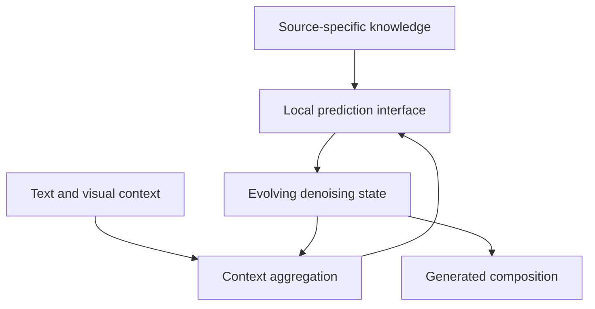

# Mechanisms of Compositional Control in Multimodal Diffusion Models

**Working direction memo, 13 September 2026.** This proposes a research structure for discussion; it is not a finished submission or an agreed final scope.

## Recommendation

Organize the proposal as **one research program with two coupled views**, connected by an explicit correspondence between representation interventions and weight updates:

1. **Reusable computation and adaptable visual knowledge:** predict which model components can transfer across domains, and use those predictions to adapt, share, or externalize selected visual knowledge.
2. **Generative language semantics for visual creation:** learn to generate and revise reasoning-relevant contextual representations from powerful AR language models, couple them with visual denoising states, and test precise semantic control.

The common scientific question is: **When can a desired change in a generated semantic representation be implemented by a compact, reusable weight update, and which representation choices make this possible?**

The proposed advance is a mechanism that makes testable predictions about adaptation and editing on unseen combinations. Parameter efficiency, personalization, and source attribution become consequences and tests of that mechanism. Thrust 1 studies how weight changes alter generated content. Thrust 2 chooses and generates representations that make semantic goals easier to specify and control, including contextual language-model states supported by ELF. These questions feed into each other: a useful semantic decomposition can reveal candidate weight directions; measured parameter couplings can guide representation and architecture design. Conditional generation of weight deltas is an integrated application of this correspondence, rather than a third independent thrust.

The central hypothesis should remain conditional: **when a domain shift changes local predictive features while preserving the context information needed to combine them, substantial adaptation may be localized to prediction and transport components; when that context structure changes, coordinated adaptation becomes necessary.** The research must determine whether this distinction predicts behavior in trained models, where it breaks, and whether it can guide useful interventions.



This is the proposed functional model, not an established exclusive assignment to particular layers. Thrust 1 tests changes to source knowledge and aggregation; Thrust 2 tests direct control at the prediction/state interface.

## Unified connection: From semantic interventions to generated weight updates

### Why representation and parameter design belong together

Suppose a creator supplies examples of an appearance or material and asks to reuse that property on different objects. A representation separating the requested appearance from object geometry makes the desired intervention explicit. The parameter-side question is whether a small update can reproduce that intervention across new prompts and generations while preserving geometry and other capabilities.

Semantic coordinate separation does not automatically imply that a small set of weights controls those coordinates. Dense shared computation may still couple the effects. The research should identify or learn interfaces where semantic separation corresponds to compact, stable parameter directions, and predict when a larger coordinated change is necessary. A mere invertible coordinate relabeling cannot create missing control directions; representation learning and architectural restrictions must be evaluated by the behavioral changes they enable.

A local diagnostic makes this question precise. Let F summarize the selected semantic properties of the final generation, including properties that should be preserved. Let s specify an intervention at an explicit denoising state or hidden representation. For each generation prompt q and image noise seed e, compare:

```text
J_weight(q,e) delta_theta ~= J_state(q,e) delta_s
```

Both Jacobians propagate the intervention through the full remaining denoising computation to F. Restrict delta_theta to candidate modules or a compact shared update basis, and fit the correspondence across multiple prompts and trajectories. Feasibility depends on whether the intended changes fall within the attainable parameter-response directions while satisfying preservation constraints. Conditioning of that map determines how large and fragile the required updates may be. The linear approximation is a diagnostic and a starting point for theory; finite changes need direct intervention tests.

A persistent update must approximate the context-dependent intervention rule across scenes, noise levels, and prompts. Reproducing one activation vector or one image is insufficient. Theoretical work can start with linear local predictors or the patch-bank model, where changing predictor prototypes is directly interpretable, then examine approximate correspondence in trained Transformers.

### Conditional generation of weight deltas

A concrete few-shot adaptation pipeline is:

```text
a ~ q_phi(a | context C, requested change g)
delta_theta = B(a)
adapted model = theta_base + delta_theta
x ~ p_(adapted model)(x | generation prompt q)
```

C contains the contextual examples or instructions. The instruction g specifies what to capture and preserve; q requests each new scene. B maps a compact adapter code into permitted parameter changes. Sample the adapter once and reuse it across several images, allowing image noise to vary independently. This distinguishes uncertainty about the adapted model from ordinary variation among its generated images. The learned conditional distribution is not automatically a calibrated Bayesian posterior.

Start with fixed/shared matrix bases at a small set of mechanistically selected modules and generate their coefficients. This keeps the output manageable and avoids treating arbitrary LoRA factor rotations as meaningful diversity. Adapter generation can be deterministic initially, with a conditional diffusion/flow model evaluated where examples leave multiple plausible, functionally different adaptations.

The argument for stochastic generation is few-shot ambiguity. A few reference images may permit several context-consistent styles or reusable feature interpretations. Different adapter samples should correspond to these behavioral alternatives, each remaining consistent across new scenes. Multiple parameterizations of the same behavior do not justify a distribution. Where the task is essentially determined, a deterministic hypernetwork may be sufficient and is a required comparison.

### Training and decisive evaluation

Construct episodic tasks with independently varied appearance, identity, and arrangement. Each episode has a small context set and disjoint query scenes. First obtain representation interventions with measured selectivity, then fit compact updates that reproduce their effects across a distribution of prompts and states. These provide standardized adapter targets for a context-to-update model; fine-tune or assess it using generation/denoising objectives, semantic effect matching, and preservation on query examples. Weight reconstruction alone is insufficient.

The central test is whether the representation-to-parameter correspondence predicts and improves adaptation on held-out compositions. Compare ordinary conditioning, activation intervention, conventional few-shot LoRA, deterministic context-to-adapter prediction, and stochastic adapter generation under comparable adaptation and selection budgets. Keep the same base model and candidate update capacity where possible. Test predicted module allocation, intervention-transfer error, desired-factor fidelity, preservation, repeated-use consistency, and adaptation cost. Do not infer meaningful uncertainty merely from spread in adapter coefficients.

### Prior work that fixes the novelty boundary

This pipeline has direct precedents. [Doc-to-LoRA](https://arxiv.org/abs/2602.15902) maps context into LoRA updates so the target LLM need not repeatedly consume it; [Text-to-LoRA](https://arxiv.org/abs/2506.06105) predicts adapters from task descriptions. [SHINE](https://arxiv.org/abs/2602.06358) also maps context-derived activations into adapter parameters. [Doc-to-Atom](https://arxiv.org/abs/2606.12400) already connects semantic decomposition with modular updates and preservation in language models.

For image generators, [DiffLoRA](https://arxiv.org/abs/2408.06740) and [LoRA Diffusion](https://arxiv.org/abs/2412.02352) use conditional diffusion to generate personalization weights from reference identity information. [Conditional LoRA Parameter Generation](https://arxiv.org/abs/2408.01415) covers description/example conditioning and visual style adaptation. [HyperLoRA](https://arxiv.org/abs/2503.16944) already separates identity-related and other adapter components and explores attribute edits through differences between generated adapters. [Interpreting the Weight Space of Customized Diffusion Models](https://arxiv.org/abs/2406.09413) studies semantic directions, generation, and editing in customized-model weight space.

Accordingly, neither conditional weight generation, stochastic LoRA synthesis, nor semantic adapter separation alone is the proposed contribution. The added scientific target is a predictive correspondence between semantic interventions and compact parameter changes within a denoising mechanism, with representation/architecture choices evaluated by whether that correspondence improves selective transfer. Existing methods provide concrete feasibility evidence and demanding baselines.

## Fit and scope

Sony's theme emphasizes internal causal mechanisms, multimodal binding, controllability, and knowledge externalization for controllable source use. It requests explicit differentiation and useful applications. The award supports a one-year project up to $150,000; the submission limit is ten pages including references, plus one budget page. The current deadline is 15 September 2026, 11:59 p.m. PDT. [Sony call and guidelines](https://www.sony.com/en/SonyInfo/research-award-program/#FocusedResearchAward).

Use **text and reference images as interacting modalities**, with image generation as the main experimental setting. A short-video extension can test persistence of one selected factor if image milestones succeed. ELF's language-reasoning result is central feasibility evidence that diffusion can generate representations derived from a powerful AR model's contextual hidden states while supporting precise semantic computation. The mathematical task is a functional test of this capability; developing a new math benchmark system is outside the proposed application scope.

## Why this structure is preferable

| Candidate direction | Strength | Main concern | Recommended role |
|---|---|---|---|
| Transformer mechanisms and parameter allocation | Closest connection to the patchwise model and architecture/transfer experiments | A universal attention-versus-MLP division is unsupported | Mechanistic center of Thrust 1 |
| AR hidden activations as denoising variables | ELF demonstrates generation in frozen Qwen's contextual representation space with substantial reasoning accuracy; image work supplies complementary visual-denoising evidence | Contextual latent diffusion and latent reasoning have precedents; the precise ELF configuration and the proposed joint visual capability must be distinguished | Central foundation of Thrust 2: generate and revise language semantics together with visual content |
| Compositional attribution | Direct relevance to Sony's source-use interests | Patch, group, and style attribution already exist; current attachments contain no validated attribution result | Bounded causal evaluation within Thrust 1 |
| Parameter efficiency alone | Concrete preliminary result | Risks becoming an architecture optimization proposal with weak source/control relevance | A measurable outcome of the mechanism |

## Thrust 1: Reusable computation and adaptable visual knowledge

### Motivation and question

A generator adapted to a new character, visual collection, or artistic domain should reuse as much existing computation as possible. Yet we do not know how to predict which parameters must change, or when separately adapted components will remain compatible.

Ask: **Can the change in local visual content and its contextual dependencies predict which parts of a diffusion Transformer need adaptation?** This is more specific than asking whether attention captures geometry and MLPs capture appearance.

The patchwise denoising view suggests three interacting operations: selecting useful context, transporting its features, and producing local predictions using learned representations. QK, VO, and MLP interventions give concrete ways to test this account. Their roles can overlap and depend on layer, noise level, and architecture; a change to VO or MLP can alter routing in later layers.

### Research approach

1. **Make predictions in controlled models.** Construct image families that vary the local feature dictionary and its composition separately: preserve the dictionary while changing spatial relationships; preserve relationships while changing appearance; change both. Begin with tractable patch distributions, then synthetic scenes with known factors, and finally natural-image transfers. Derive sufficient conditions for a context summary to remain useful and quantify denoising error when the conditional prediction rule changes.
2. **Test the predictions through interventions.** Compare parameter transplantation, matched activation interventions, and direct restricted fine-tuning. Predict which components will transfer on held-out source-target pairs before measuring their adaptation outcomes. Compare with equal-budget LoRA, alternative component allocations, and jointly adapted models. Include multiple training seeds and separate validation for allocation selection.
3. **Use the mechanism to design transferable modules.** Test shared prototype banks with layer-specific projections and small source-specific residual modules. Vary compositional diversity while controlling training size, visual vocabulary, and compute to test whether more varied compositions actually improve transfer. Parameter count, adaptation time, retained source behavior, and target quality are distinct measurements.

A theoretical milestone should concern the relationship between context sufficiency, changed local prediction rules, and transfer error in an explicit model class. A generic claim that Transformers are patchwise denoisers would not supply enough new theory. Extending a controlled-model result to trained networks requires measurement of approximation error and predictive validation.

The initial benchmark should cross unchanged/changed local content with unchanged/changed compositional relationships. Preserve shared initialization or align the interfaces when transplanting weights: a failed swap between independently trained coordinate systems would not isolate a failure of the proposed content/composition distinction.

### Attribution and externalization as a bounded extension

Where a source-specific module or external bank has a verified origin, test a concrete causal claim: changing or removing that source changes a specified factor through a predicted internal path. Trace source/module interventions into intermediate features and final output changes. Compare the result with similarity attribution and counterfactual retraining on small controlled datasets.

Distinguish three questions:

- **Module contribution:** what changes if this known module is removed during generation?
- **Training-source contribution:** what changes if the source is excluded from training? Use retraining controls at tractable scale to validate approximations.
- **Feature resemblance:** which source has a similar patch or attribute? This alone does not establish either causal contribution above.

Start with newly introduced source-specific knowledge added through a controlled interface. Removing that interface can support controllable use of that contribution; it does not guarantee erasure of related knowledge already distributed through a pretrained base. Allow overlapping group contributions and unresolved cases rather than forcing one training source per generated feature.

### Distinguishing result

The important outcome is **an accurate prediction of which changes can be localized and composed**, followed by a selective adaptation method that improves the quality/preservation/compute tradeoff. Swapping weights successfully after observing the results would be weaker evidence.

## Thrust 2: Generative language semantics for visual creation

### Motivation and question

A creator may want the identity from one reference, the spatial arrangement specified by text, and the appearance of a separate visual collection. Even when a model's features encode these factors, changing a feature may also alter unrelated content, be overwritten by subsequent denoising, or create an inconsistent latent state.

Ask: **Can a multimodal diffusion model generate and revise the precise semantics represented inside a powerful AR language model together with visual content, so that objects, relations, and constraints remain consistent?**

### Why ELF is central feasibility evidence

ELF uses projected contextual activations from frozen Qwen3-4B-Instruct-2507 blocks 16, 24, and 32 as the answer-representation targets of a separately trained diffusion/flow model. At inference Qwen encodes the question once; ELF generates the answer-state sequence from noise and decodes it to text. Qwen does not autoregressively produce the solution. The resulting 61.94% GSM8K accuracy provides functional evidence that generation in this representation space can support substantial multi-step reasoning. The relevant result is this generative capability, not chiefly the arithmetic task or the 7.77-point gain from changing inference schedules.

This supports a proposal-level feasibility argument: powerful language-model representations need not remain only conditioning inputs or outputs of a separate AR planner; they can themselves be objects of generative modeling. Quantifying how much the pretrained organization causes the performance, or whether the model reproduces Qwen's internal reasoning procedure, requires further evidence. Neither claim is needed for the initial feasibility argument.

The vision-language extension is proposed work. Keep the user's prompt as fixed conditioning, and introduce additional generated language-semantic variables representing a scene description, inferred relationships, or constraints. Couple those variables to visual latents during denoising. Paired visual data and precise descriptions must teach that correspondence: language-only success does not supply visual grounding by itself. Compare fixed LLM conditioning, an AR-generated scene plan, generated semantic states followed by visual generation, and jointly revisable semantic/visual states under comparable budgets.

The immediate scientific question is which semantic information survives this coupling and how it reaches image generation through the Transformer's attention, transport, and prediction mechanisms. A first use case can test exact object counts, attribute bindings, and spatial relations under crossed text/reference inputs. Identity preservation remains another candidate once its relevant representation is identified.

Treat the denoising state, hidden activations, and model parameters as different intervention sites. Do not assume DINO or Qwen features already separate identity, geometry, appearance, and motion.

| Intervention site | Example | What must be established |
|---|---|---|
| Explicit denoising variables | Change or hold a candidate identity/structure representation | It selectively affects the intended output factor and remains compatible with other state variables |
| Hidden activations | Transplant a reference-derived feature through selected components | It mediates the proposed effect rather than merely correlating with it |
| Parameters or source modules | Reuse a small update across prompts and scenes | The intervention retains its effect on unseen compositions with limited collateral changes |

### Research approach

1. **Establish semantic transfer and grounding.** Generate Qwen-derived language states and visual states for paired scenes with explicit relational descriptions. Compare frozen contextual activations with token embeddings and alternative encoders where feasible. Test whether decoded language constraints and independently measured image content agree. Use interventions on the semantic states, alongside the interfaces identified in Thrust 1, to identify which internal pathways transmit the intended change. Measure unintended changes and persistence as well as semantic decoding quality.
2. **Optimize representation evolution for a specified editing objective.** Extend asynchronous scheduling toward edit fidelity and preservation, alongside quality and compute. Compare fixed semantic-leading schedules, learned schedules, and direct activation steering. Permit revision of an early representation when it conflicts with a later constraint; do not presume that early semantic commitment is always best.
3. **Test cross-modal composition.** Use crossed prompts and references that specify compatible or conflicting identity, pose, location, and appearance. Evaluate whether the intended modality supplies the requested factor, particularly on held-out combinations. Make preservation of one identity while changing layout and appearance the primary demonstration.

The scientific deliverable is a predictive relation between a factor's internal representation, its route through the denoiser, and its persistence under intervention. An interpretable probe or an improved aggregate FID alone is insufficient.

### A useful bridge between the thrusts

**When can a repeated representation intervention be converted into a small reusable parameter update?** This is now the organizing connection of the program, developed in the unified section above. The few-shot demonstration conditions a model of adapter coefficients on references and the requested semantic change. It must preserve the intervention's effect across new prompts without asserting universal equivalence between latent, activation, and weight edits. ELF remains central evidence for the richness of the semantic states that this program can attempt to generate and manipulate.

## Closest work and the differentiation we must earn

The following are substantive overlaps, not merely background citations. This is a targeted literature check, not an exhaustive priority assessment.

| Existing work | What already exists | Proposed additional contribution |
|---|---|---|
| [Latent Diffusion for Language Generation](https://arxiv.org/abs/2212.09462), [STAR-LDM](https://arxiv.org/abs/2602.20528) | Diffusion over language representations and semantic plans, using pretrained encoder/decoder machinery | ELF's specific evidence concerns generated multidepth frozen-AR contextual states with reasoning evaluation; proposed work couples such states to visual generation |
| [LaDiR](https://arxiv.org/abs/2510.04573), [VDLM](https://arxiv.org/abs/2602.15870) | Substantial reasoning through diffusion over learned thought latents or semantic text-span embeddings; additional pretrained reasoning or rendering machinery remains | Distinguish ELF's separately trained continuous denoiser over frozen Qwen contextual token states and its inference pipeline. Do not claim that latent diffusion reasoning itself is unprecedented |
| [DiHAL](https://arxiv.org/abs/2605.14368) | Diffusion reconstructs selected original AR hidden states to replace a lower-layer computational prefix, retaining upper causal layers and the LM head | Generate an answer-state sequence conditioned on a question with an independent diffusion model, then investigate joint visual generation; hidden-state diffusion alone is not the novelty |
| [UniDiffuser](https://arxiv.org/abs/2303.06555) | Joint continuous diffusion of image and text representations with independent noise levels | Study contextual semantics from strong reasoning-capable AR models and validate precise semantic constraints in the generated visual content |
| [LatentLM](https://arxiv.org/abs/2412.08635), [MammothModa2](https://arxiv.org/abs/2511.18262) | AR hidden states or AR-generated semantic content condition visual diffusion | Make the contextual semantic states themselves generative diffusion variables and test the benefit of jointly revising them |
| [RepFusion](https://arxiv.org/abs/2606.14700), [Mural](https://arxiv.org/abs/2606.29013) | Their primary abstracts describe evolving MLLM conditioning or coupling a frozen reasoning-capable LLM to image diffusion | Dynamic conditioning and strong LLM semantics in image generation are not sufficient novelty claims. The proposed distinction is generative modeling of the contextual semantic states; verify these recent papers' full methods before final priority claims |
| [An analytic theory of creativity in convolutional diffusion models](https://arxiv.org/abs/2412.20292), [Locality in Image Diffusion Models Emerges from Data Statistics](https://arxiv.org/abs/2509.09672) | Patch composition and data-driven locality already explain aspects of diffusion generalization | Predict the behavior of trained Transformer components as content and contextual dependencies vary |
| [REPA](https://arxiv.org/abs/2410.06940), [RAE](https://arxiv.org/abs/2510.11690), [RAEv2](https://arxiv.org/abs/2605.18324) | External features improve generation; representation latents can replace conventional VAE latents; encoder and hidden-state properties have been studied | Determine which features are selectively controllable and explain preservation across interventions and unseen compositions |
| [SFD](https://arxiv.org/abs/2512.04926), [Latent Forcing](https://arxiv.org/abs/2602.11401), [SeFi-Image](https://arxiv.org/abs/2606.22568) | Different representation groups follow different schedules; semantics-first generation extends to text-to-image | Predict and optimize the survival and collateral effects of a specified edit, including cases requiring semantic revision |
| [ReDi](https://arxiv.org/abs/2504.16064), [CoReDi](https://arxiv.org/abs/2604.17492) | Joint feature/image generation, representation guidance, and adaptation of the representation space | A causal factor-selection criterion tied to controlled intervention outcomes |
| [Plug-and-Play Diffusion Features](https://arxiv.org/abs/2211.12572), [TIDE](https://arxiv.org/abs/2503.07050), [SHIFT](https://arxiv.org/abs/2604.09213) | Feature injection and interpretable steering, including layer/time-dependent interventions | Predict transfer and selectivity from the compositional mechanism, beyond searching for successful steering sites |
| [Custom Diffusion](https://arxiv.org/abs/2212.04488) | Selective parameter adaptation for multiple concepts | Predict allocation and compatibility for different types of domain shift; validate against matched adaptation budgets |
| [Finding NeMo](https://arxiv.org/abs/2406.02366) | Memorized examples can be associated with and suppressed through cross-attention neurons | Test distributed, architecture-dependent feature storage and reusable composition; do not assert that memorization lives exclusively in MLPs |
| [Semi-Parametric Neural Image Synthesis](https://arxiv.org/abs/2204.11824) | Retrieval provides local content while the generator learns scene composition; database replacement changes domains | Derive and test compatibility conditions at internal computation interfaces; relate module changes to causal output effects |
| [Knowledge Externalization](https://proceedings.iclr.cc/paper_files/paper/2026/hash/7e9c2053258b1bdd32ff2654802cd594-Abstract-Conference.html) | MLLM knowledge can be moved into editable, composable memory tokens | Investigate a denoising mechanism and its source-dependent contribution over a generation trajectory; external memory alone is not the novelty |
| [Nonparametric Data Attribution](https://arxiv.org/abs/2510.14269), [GUDA](https://arxiv.org/abs/2601.22651) | Multiscale patch attribution and group/style attribution via unlearning | Validate source-to-component-to-state effects and distinguish module removal from training-data removal |

Do not claim novelty merely from putting these ingredients together. The core claim must be a useful prediction or intervention guarantee within a stated scope, with a result that fails if the proposed mechanism is wrong.

## Preliminary evidence and its limits

| Source | Supported result | How to use it |
|---|---|---|
| [From Softmax to Score](https://papers.nips.cc/paper_files/paper/2025/hash/d27af2bebeab8a3e6f3848fc71736235-Abstract-Conference.html), NeurIPS 2025 | Constructive equivalences between Transformer attention and denoising algorithms | Establishes theoretical experience and an analytical starting point; does not identify what every trained DiT has learned |
| Attached mechanistic manuscript, pp. 2–5 | Explicit locality theorem for Gaussian MRFs; conditional-mean sufficiency formulation; attention aggregation/transport decomposition | Supports the controlled-model program. Natural-image locality and an exclusive MLP memory interpretation are not established general theorems |
| Attached Experiment 1, pp. 6–7 | CelebA64: ordinary DiT 10.215M parameters/FID 17.574; shared DiT-MLP 10.240M/FID 14.304 | Evidence that the mechanism motivates useful parameter allocation; one training seed, small models, no demonstrated runtime speedup |
| Attached Experiment 3, pp. 2, 5, 10–12 | With adapted VO+MLP and source QK, paired recovery is 0.815 for CelebA→AAHQ and 0.143 for CelebA→STL-10 | The success and failure motivate the transfer-compatibility question. Recovery is a DINO-feature metric relative to the jointly adapted generator |
| [Variational Trajectory Optimization](https://arxiv.org/abs/2602.19512) | Learns matrix-valued anisotropic noise schedules with a trajectory objective and develops a corresponding solver | Provides machinery for subspace-dependent generation dynamics |
| [Learning When to Denoise](https://arxiv.org/abs/2606.19662) | With a matched 675M backbone, 200-epoch training reaches AutoGuidance FID 1.05, matching an 800-epoch SFD-XL result | Strong image-generation feasibility for learned asynchronous schedules; the reported setting does not establish selective editing or video control |
| Attached ELF-L summary and CSV, epoch 12 | A separately trained diffusion model generates projected frozen-Qwen contextual answer states and decodes them to text: 61.94% GSM8K, with Qwen used once to encode the prompt. The same checkpoint gives 54.17% with synchronous clocks | Central feasibility evidence for generatively modeling reasoning-relevant AR representations. The schedule improvement is secondary; neither a matched AR superiority claim nor established visual grounding is required or supported here |

Experiment 3 jointly adapts QK, VO, and MLP and then restores selected components to source values. This is not evidence that freezing those components throughout adaptation gives the same result. Endpoints use existing test-FID evaluations, and illustrative images were deliberately selected. Direct restricted training, independent evaluation selection, and additional seeds belong in the proposed work.

The ELF comparison pools two generation seeds over the same 1,319 questions; the 2,638 trials are not distinct test questions or a voting protocol. Give it a central role in the feasibility argument for generating language-model semantics, with the reasoning score serving as a functional check. The supplied evidence does not support a claim of superiority over a directly evaluated AR baseline. The targeted literature check identifies close predecessors but no exact match to the full stated ELF configuration; this is insufficient to assert a universal first. The proposed contribution should center on generating and revising these semantic states jointly with visual content and measuring the mechanism of semantic control.

The mechanistic manuscript is incomplete in several sections. Cite its completed mathematical statements and the separate experiment reports, and identify the remaining interpretation as a hypothesis.

## Two proposed creator use cases

These are proposed research demonstrations, not claims about existing Sony product capabilities or agreed deployment plans. They are relevant to the visual creation and creator-protection interests described in [Sony AI's research overview](https://ai.sony/).

1. **Consistent character or object creation across compositions.** A creator supplies a few reference images and text describing a new scene. Change pose, location, and rendering appearance while preserving selected identity features. Show crossed combinations and conflict cases, with explicit measurements of both edit success and preservation. Storyboard images are the primary output; a short clip is optional.
2. **Controllable use of a visual reference collection.** Add a collection through a small source-specific module, generate it in new compositions, and measure what changes when the module is replaced or disabled. Report which properties depend on that module through verified interventions. Begin with source knowledge withheld from the base in controlled experiments so the removal claim is interpretable.

## One-year milestones and scope boundaries

| Period | Main result | Evidence of completion |
|---|---|---|
| Months 1–3 | Controlled benchmark and mechanism predictions | Predeclared predictions of component transfer; baseline sharing, transplant, and adaptation results |
| Months 4–6 | Test transfer-guided adaptation | Held-out transfer accuracy and quality/preservation/compute comparisons; document where component coordination is necessary |
| Months 7–9 | Generative language semantics coupled to visual states; a tractable intervention-to-update test | A text/reference image demonstration with independent relation/binding measurements; compare state intervention and reusable adapter effects |
| Months 10–12 | Integrated few-shot adaptation demonstration and bounded attribution evaluation | Context-generated adapters at the validated interface; compare deterministic and stochastic generation where ambiguity matters; source-module intervention audit and final reproducible artifacts |

Large-scale source externalization and video remain contingent extensions. Do not promise broad image/video/audio generation, universal training-data attribution, foundation-model retraining, and a new language-reasoning model in one year.

If transfer prediction fails, report the measured compatibility boundary and test small joint routing/prediction adapters; that fallback should still answer a scientific question. If a candidate representation does not support selective edits, characterize its entanglement and evaluate a more constrained interface rather than presuming semantic labels guarantee control.

## Figures that will make the proposal easy to assess

1. **Mechanism and interventions:** one diagram connecting source knowledge, context aggregation, hidden features, and the evolving denoising state. Mark which relations are established in simplified models and which are research hypotheses.
2. **One success and one failure of component reuse:** show Source / QK-only / VO+MLP / Joint for CelebA→AAHQ and CelebA→STL-10, using the existing experiment panels. Label them as selected illustrations and accompany them with the full quantitative recovery comparison.
3. **Two complementary feasibility results:** show the frozen-Qwen representation extraction and ELF answer-state generation with the reasoning score as a functional validation; alongside it, show the published visual multi-representation denoising result. Their conjunction motivates the proposed language-semantic/visual model. The ELF figure should emphasize what is generated and how Qwen is used, rather than mainly plotting the schedule gain. The matched-budget architecture FID is a separate compact result if space permits.
4. **Proposed demonstration schematic:** reference identity crossed with new layouts/appearances, plus source-module removal. Label planned outputs as proposed; do not substitute synthetic illustrative images for experimental results.

## Drafting priority

Give both coupled views substantive space within one program. The main connection is whether representation choices make desired semantic changes realizable through compact reusable weight updates. Preserve ELF's central role as feasibility evidence for generating powerful language representations; use the patchwise mechanism and transfer results to study the parameter correspondence. Treat the conditional weight generator as the integrated few-shot demonstration at one validated interface, rather than another broad model-building project. Keep attribution as a limited diagnostic; complete unlearning is not a promised outcome. Start with controlled local appearance, spatial composition, and precise language-described relations, adding identity only where intervention evidence supports it.
