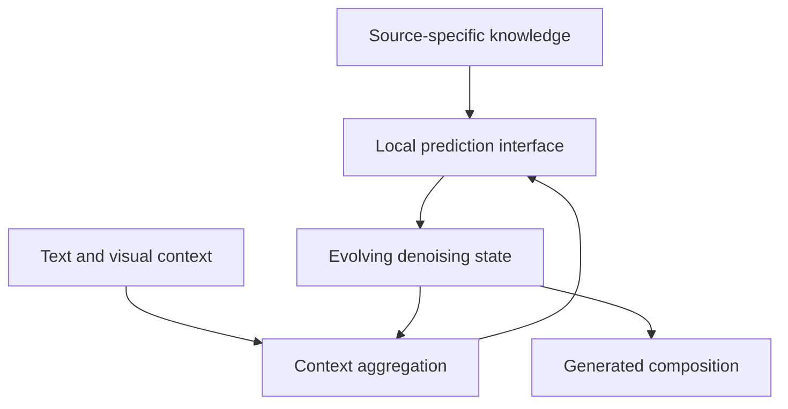

# Mechanisms of Compositional Control in Multimodal Diffusion Models

**Working direction memo, 13 September 2026.** This proposes a research structure for discussion; it is not a finished submission or an agreed final scope.

## Recommendation

Organize the proposal around **two connected thrusts**:

1. **Reusable computation and adaptable visual knowledge:** predict which model components can transfer across domains, and use those predictions to adapt, share, or externalize selected visual knowledge.
2. **Selective control through generative representations:** identify representations and denoising dynamics that let a creator change one factor while preserving others.

The common scientific question is: **How does a generative Transformer turn stored visual knowledge into a particular composition, and which interventions let us change that composition selectively?**

The proposed advance is a mechanism that makes testable predictions about adaptation and editing on unseen combinations. Parameter efficiency, personalization, and source attribution become consequences and tests of that mechanism. Thrust 1 identifies candidate interfaces and their transfer boundaries; Thrust 2 exposes those interfaces to creator control. Each has measurable intermediate results, without requiring a universal theory of the network.

The central hypothesis should remain conditional: **when a domain shift changes local predictive features while preserving the context information needed to combine them, substantial adaptation may be localized to prediction and transport components; when that context structure changes, coordinated adaptation becomes necessary.** The research must determine whether this distinction predicts behavior in trained models, where it breaks, and whether it can guide useful interventions.

This is the proposed functional model, not an established exclusive assignment to particular layers. Thrust 1 tests changes to source knowledge and aggregation; Thrust 2 tests direct control at the prediction/state interface.

## Fit and scope

Sony's theme emphasizes internal causal mechanisms, multimodal binding, controllability, and knowledge externalization for controllable source use. It requests explicit differentiation and useful applications. The award supports a one-year project up to $150,000; the submission limit is ten pages including references, plus one budget page. The current deadline is 15 September 2026, 11:59 p.m. PDT. [Sony call and guidelines](https://www.sony.com/en/SonyInfo/research-award-program/#FocusedResearchAward).

Use **text and reference images as interacting modalities**, with image generation as the main experimental setting. A short-video extension can test persistence of one selected factor if image milestones succeed. Language reasoning supplies supporting evidence for representation-dependent denoising, rather than another application workstream.

## Why this structure is preferable

| Candidate direction | Strength | Main concern | Recommended role |
|---|---|---|---|
| Transformer mechanisms and parameter allocation | Closest connection to the patchwise model and architecture/transfer experiments | A universal attention-versus-MLP division is unsupported | Mechanistic center of Thrust 1 |
| Activations as denoising variables | Strongest large-model feasibility results and clear connection to multimodal control | Semantic representation generation and asynchronous schedules already have close precedents | Thrust 2, focused on selective intervention and preservation |
| Compositional attribution | Direct relevance to Sony's source-use interests | Patch, group, and style attribution already exist; current attachments contain no validated attribution result | Bounded causal evaluation within Thrust 1 |
| Parameter efficiency alone | Concrete preliminary result | Risks becoming an architecture optimization proposal with weak source/control relevance | A measurable outcome of the mechanism |

## Thrust 1: Reusable computation and adaptable visual knowledge

### Motivation and question

A generator adapted to a new character, visual collection, or artistic domain should reuse as much existing computation as possible. Yet we do not know how to predict which parameters must change, or when separately adapted components will remain compatible.

Ask: **Can the change in local visual content and its contextual dependencies predict which parts of a diffusion Transformer need adaptation?** This is more specific than asking whether attention captures geometry and MLPs capture appearance.

The patchwise denoising view suggests three interacting operations: selecting useful context, transporting its features, and producing local predictions using learned representations. QK, VO, and MLP interventions give concrete ways to test this account. Their roles can overlap and depend on layer, noise level, and architecture; a change to VO or MLP can alter routing in later layers.

### Research approach

1. **Make predictions in controlled models.** Construct image families that vary the local feature dictionary and its composition separately: preserve the dictionary while changing spatial relationships; preserve relationships while changing appearance; change both. Begin with tractable patch distributions, then synthetic scenes with known factors, and finally natural-image transfers. Derive sufficient conditions for a context summary to remain useful and quantify denoising error when the conditional prediction rule changes.
2. **Test the predictions through interventions.** Compare parameter transplantation, matched activation interventions, and direct restricted fine-tuning. Predict which components will transfer on held-out source-target pairs before measuring their adaptation outcomes. Compare with equal-budget LoRA, alternative component allocations, and jointly adapted models. Include multiple training seeds and separate validation for allocation selection.
3. **Use the mechanism to design transferable modules.** Test shared prototype banks with layer-specific projections and small source-specific residual modules. Vary compositional diversity while controlling training size, visual vocabulary, and compute to test whether more varied compositions actually improve transfer. Parameter count, adaptation time, retained source behavior, and target quality are distinct measurements.

A theoretical milestone should concern the relationship between context sufficiency, changed local prediction rules, and transfer error in an explicit model class. A generic claim that Transformers are patchwise denoisers would not supply enough new theory. Extending a controlled-model result to trained networks requires measurement of approximation error and predictive validation.

The initial benchmark should cross unchanged/changed local content with unchanged/changed compositional relationships. Preserve shared initialization or align the interfaces when transplanting weights: a failed swap between independently trained coordinate systems would not isolate a failure of the proposed content/composition distinction.

### Attribution and externalization as a bounded extension

Where a source-specific module or external bank has a verified origin, test a concrete causal claim: changing or removing that source changes a specified factor through a predicted internal path. Trace source/module interventions into intermediate features and final output changes. Compare the result with similarity attribution and counterfactual retraining on small controlled datasets.

Distinguish three questions:

- **Module contribution:** what changes if this known module is removed during generation?
- **Training-source contribution:** what changes if the source is excluded from training? Use retraining controls at tractable scale to validate approximations.
- **Feature resemblance:** which source has a similar patch or attribute? This alone does not establish either causal contribution above.

Start with newly introduced source-specific knowledge added through a controlled interface. Removing that interface can support controllable use of that contribution; it does not guarantee erasure of related knowledge already distributed through a pretrained base. Allow overlapping group contributions and unresolved cases rather than forcing one training source per generated feature.

### Distinguishing result

The important outcome is **an accurate prediction of which changes can be localized and composed**, followed by a selective adaptation method that improves the quality/preservation/compute tradeoff. Swapping weights successfully after observing the results would be weaker evidence.

## Thrust 2: Selective control through generative representations

### Motivation and question

A creator may want the identity from one reference, the spatial arrangement specified by text, and the appearance of a separate visual collection. Even when a model's features encode these factors, changing a feature may also alter unrelated content, be overwritten by subsequent denoising, or create an inconsistent latent state.

Ask: **Which representation interfaces make an intended edit persist through generation while preserving the other factors?**

Treat the denoising state, hidden activations, and model parameters as different intervention sites. Do not assume DINO or Qwen features already separate identity, geometry, appearance, and motion.

| Intervention site | Example | What must be established |
|---|---|---|
| Explicit denoising variables | Change or hold a candidate identity/structure representation | It selectively affects the intended output factor and remains compatible with other state variables |
| Hidden activations | Transplant a reference-derived feature through selected components | It mediates the proposed effect rather than merely correlating with it |
| Parameters or source modules | Reuse a small update across prompts and scenes | The intervention retains its effect on unseen compositions with limited collateral changes |

### Research approach

1. **Expose and test the interfaces identified in Thrust 1.** On controlled counterfactual examples, compare their representation interventions with the corresponding parameter interventions. External features and denoising-state partitions are candidate coordinates for expressing the same desired change. Measure intended change, unintended changes, and persistence over the remainder of the trajectory. Use replacement and rescue interventions, independent output evaluations, and controls for off-distribution perturbations.
2. **Optimize representation evolution for a specified editing objective.** Extend asynchronous scheduling toward edit fidelity and preservation, alongside quality and compute. Compare fixed semantic-leading schedules, learned schedules, and direct activation steering. Permit revision of an early representation when it conflicts with a later constraint; do not presume that early semantic commitment is always best.
3. **Test cross-modal composition.** Use crossed prompts and references that specify compatible or conflicting identity, pose, location, and appearance. Evaluate whether the intended modality supplies the requested factor, particularly on held-out combinations. Make preservation of one identity while changing layout and appearance the primary demonstration.

The scientific deliverable is a predictive relation between a factor's internal representation, its route through the denoiser, and its persistence under intervention. An interpretable probe or an improved aggregate FID alone is insufficient.

### A useful bridge between the thrusts

**When can a repeated representation intervention be converted into a small reusable parameter update?** For example, an intervention derived from several references might be reused as a source module across new prompts without repeating the original reference processing. Analyze an exact version in the simplified patch model and a local approximation in trained networks; test how far the effect transfers before nonlinear interactions invalidate it. This should remain a focused experiment, rather than a general claim that latent, activation, and weight edits are equivalent.

## Closest work and the differentiation we must earn

The following are substantive overlaps, not merely background citations. This is a targeted literature check, not an exhaustive priority assessment.

| Existing work | What already exists | Proposed additional contribution |
|---|---|---|
| [An analytic theory of creativity in convolutional diffusion models](https://arxiv.org/abs/2412.20292), [Locality in Image Diffusion Models Emerges from Data Statistics](https://arxiv.org/abs/2509.09672) | Patch composition and data-driven locality already explain aspects of diffusion generalization | Predict the behavior of trained Transformer components as content and contextual dependencies vary |
| [REPA](https://arxiv.org/abs/2410.06940), [RAE](https://arxiv.org/abs/2510.11690), [RAEv2](https://arxiv.org/abs/2605.18324) | External features improve generation; representation latents can replace conventional VAE latents; encoder and hidden-state properties have been studied | Determine which features are selectively controllable and explain preservation across interventions and unseen compositions |
| [SFD](https://arxiv.org/abs/2512.04926), [Latent Forcing](https://arxiv.org/abs/2602.11401), [SeFi-Image](https://arxiv.org/abs/2606.22568) | Different representation groups follow different schedules; semantics-first generation extends to text-to-image | Predict and optimize the survival and collateral effects of a specified edit, including cases requiring semantic revision |
| [ReDi](https://arxiv.org/abs/2504.16064), [CoReDi](https://arxiv.org/abs/2604.17492) | Joint feature/image generation, representation guidance, and adaptation of the representation space | A causal factor-selection criterion tied to controlled intervention outcomes |
| [Plug-and-Play Diffusion Features](https://arxiv.org/abs/2211.12572), [TIDE](https://arxiv.org/abs/2503.07050), [SHIFT](https://arxiv.org/abs/2604.09213) | Feature injection and interpretable steering, including layer/time-dependent interventions | Predict transfer and selectivity from the compositional mechanism, beyond searching for successful steering sites |
| [Custom Diffusion](https://arxiv.org/abs/2212.04488) | Selective parameter adaptation for multiple concepts | Predict allocation and compatibility for different types of domain shift; validate against matched adaptation budgets |
| [Finding NeMo](https://arxiv.org/abs/2406.02366) | Memorized examples can be associated with and suppressed through cross-attention neurons | Test distributed, architecture-dependent feature storage and reusable composition; do not assert that memorization lives exclusively in MLPs |
| [Semi-Parametric Neural Image Synthesis](https://arxiv.org/abs/2204.11824) | Retrieval provides local content while the generator learns scene composition; database replacement changes domains | Derive and test compatibility conditions at internal computation interfaces; relate module changes to causal output effects |
| [Knowledge Externalization](https://proceedings.iclr.cc/paper_files/paper/2026/hash/7e9c2053258b1bdd32ff2654802cd594-Abstract-Conference.html) | MLLM knowledge can be moved into editable, composable memory tokens | Investigate a denoising mechanism and its source-dependent contribution over a generation trajectory; external memory alone is not the novelty |
| [Nonparametric Data Attribution](https://arxiv.org/abs/2510.14269), [GUDA](https://arxiv.org/abs/2601.22651) | Multiscale patch attribution and group/style attribution via unlearning | Validate source-to-component-to-state effects and distinguish module removal from training-data removal |

Do not claim novelty merely from putting these ingredients together. The core claim must be a useful prediction or intervention guarantee within a stated scope, with a result that fails if the proposed mechanism is wrong.

## Preliminary evidence and its limits

| Source | Supported result | How to use it |
|---|---|---|
| [From Softmax to Score](https://papers.nips.cc/paper_files/paper/2025/hash/d27af2bebeab8a3e6f3848fc71736235-Abstract-Conference.html), NeurIPS 2025 | Constructive equivalences between Transformer attention and denoising algorithms | Establishes theoretical experience and an analytical starting point; does not identify what every trained DiT has learned |
| Attached mechanistic manuscript, pp. 2–5 | Explicit locality theorem for Gaussian MRFs; conditional-mean sufficiency formulation; attention aggregation/transport decomposition | Supports the controlled-model program. Natural-image locality and an exclusive MLP memory interpretation are not established general theorems |
| Attached Experiment 1, pp. 6–7 | CelebA64: ordinary DiT 10.215M parameters/FID 17.574; shared DiT-MLP 10.240M/FID 14.304 | Evidence that the mechanism motivates useful parameter allocation; one training seed, small models, no demonstrated runtime speedup |
| Attached Experiment 3, pp. 2, 5, 10–12 | With adapted VO+MLP and source QK, paired recovery is 0.815 for CelebA→AAHQ and 0.143 for CelebA→STL-10 | The success and failure motivate the transfer-compatibility question. Recovery is a DINO-feature metric relative to the jointly adapted generator |
| [Variational Trajectory Optimization](https://arxiv.org/abs/2602.19512) | Learns matrix-valued anisotropic noise schedules with a trajectory objective and develops a corresponding solver | Provides machinery for subspace-dependent generation dynamics |
| [Learning When to Denoise](https://arxiv.org/abs/2606.19662) | With a matched 675M backbone, 200-epoch training reaches AutoGuidance FID 1.05, matching an 800-epoch SFD-XL result | Strong image-generation feasibility for learned asynchronous schedules; the reported setting does not establish selective editing or video control |
| Attached ELF-L summary and CSV, epoch 12 | Same synchronously trained checkpoint/EMA: GSM8K 54.17%→61.94%, +7.77 percentage points, by changing inference clocks at ODE32 without more training | Supports denoising contextual representations with separately controlled trajectories; no matched AR superiority or end-to-end speedup is established by the supplied files |

Experiment 3 jointly adapts QK, VO, and MLP and then restores selected components to source values. This is not evidence that freezing those components throughout adaptation gives the same result. Endpoints use existing test-FID evaluations, and illustrative images were deliberately selected. Direct restricted training, independent evaluation selection, and additional seeds belong in the proposed work.

The ELF comparison pools two generation seeds over the same 1,319 questions; the 2,638 trials are not distinct test questions or a voting protocol. Keep it as a small cross-domain feasibility result. The supplied evidence does not support a claim of superiority over a directly evaluated AR baseline.

The mechanistic manuscript is incomplete in several sections. Cite its completed mathematical statements and the separate experiment reports, and identify the remaining interpretation as a hypothesis.

## Two proposed creator use cases

These are proposed research demonstrations, not claims about existing Sony product capabilities or agreed deployment plans. They are relevant to the visual creation and creator-protection interests described in [Sony AI's research overview](https://ai.sony/).

1. **Consistent character or object creation across compositions.** A creator supplies a few reference images and text describing a new scene. Change pose, location, and rendering appearance while preserving selected identity features. Show crossed combinations and conflict cases, with explicit measurements of both edit success and preservation. Storyboard images are the primary output; a short clip is optional.
2. **Controllable use of a visual reference collection.** Add a collection through a small source-specific module, generate it in new compositions, and measure what changes when the module is replaced or disabled. Report which properties depend on that module through verified interventions. Begin with source knowledge withheld from the base in controlled experiments so the removal claim is interpretable.

## One-year milestones and scope boundaries

| Period | Main result | Evidence of completion |
|---|---|---|
| Months 1–3 | Controlled benchmark and mechanism predictions | Predeclared predictions of component transfer; baseline sharing, transplant, and adaptation results |
| Months 4–6 | Test transfer-guided adaptation | Held-out transfer accuracy and quality/preservation/compute comparisons; document where component coordination is necessary |
| Months 7–9 | Selective representation intervention | A reference-and-text image demonstration with independent factor measurements and comparisons to steering/schedule baselines |
| Months 10–12 | Integrated demonstration and bounded attribution evaluation | Source-module intervention audit; controlled retraining checks; final report and reproducible evaluation artifacts |

Large-scale source externalization and video remain contingent extensions. Do not promise broad image/video/audio generation, universal training-data attribution, foundation-model retraining, and a new language-reasoning model in one year.

If transfer prediction fails, report the measured compatibility boundary and test small joint routing/prediction adapters; that fallback should still answer a scientific question. If a candidate representation does not support selective edits, characterize its entanglement and evaluate a more constrained interface rather than presuming semantic labels guarantee control.

## Figures that will make the proposal easy to assess

1. **Mechanism and interventions:** one diagram connecting source knowledge, context aggregation, hidden features, and the evolving denoising state. Mark which relations are established in simplified models and which are research hypotheses.
2. **One success and one failure of component reuse:** show Source / QK-only / VO+MLP / Joint for CelebA→AAHQ and CelebA→STL-10, using the existing experiment panels. Label them as selected illustrations and accompany them with the full quantitative recovery comparison.
3. **A compact feasibility panel:** matched-budget FID from Experiment 1 alongside the published asynchronous-schedule result. Include ELF only if it helps demonstrate representation generality without diluting the visual-content focus.
4. **Proposed demonstration schematic:** reference identity crossed with new layouts/appearances, plus source-module removal. Label planned outputs as proposed; do not substitute synthetic illustrative images for experimental results.

## Drafting priority

Give Thrust 1 slightly more space because it provides the distinctive mechanistic question. Make Thrust 2 its creator-facing intervention counterpart through a shared interface and benchmark. Keep attribution as an explicit, limited diagnostic rather than a third full program; complete unlearning is not a promised outcome. The most important unresolved choice is how broadly to define the initial controlled factors; start with local appearance and spatial composition, then add identity only where the intervention evidence supports it.
