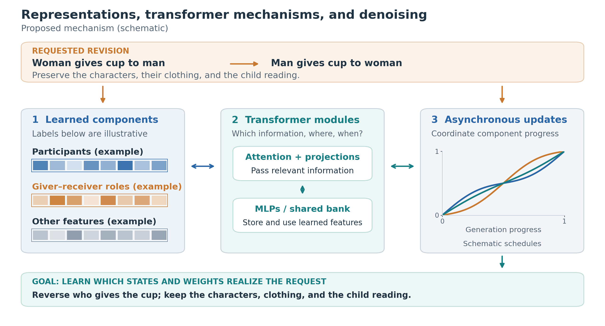
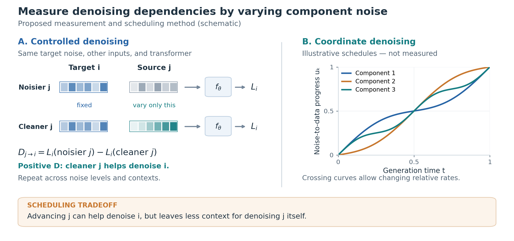
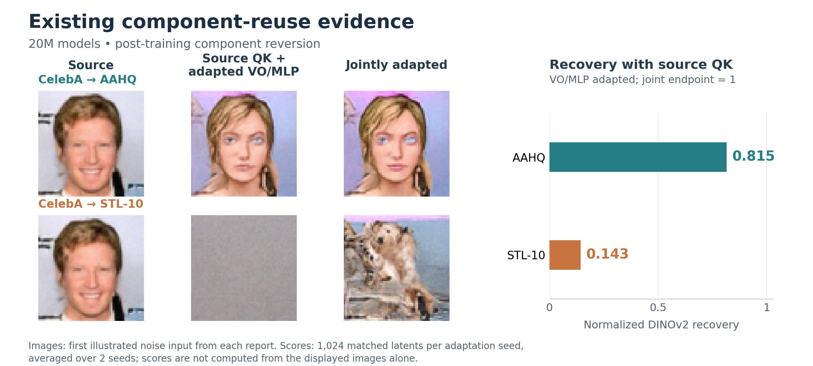
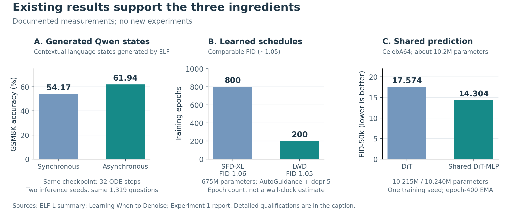

# How Representations and Weights Shape Multimodal Generation

**Principal investigator:** Xiang Cheng, Department of Electrical and Computer Engineering, Duke University  
**Focused Research Theme:** Internal Mechanisms of Multimodal Generative Models for Content Creation  
**Project duration:** 12 months  
**PI contact:** [Email to insert]; [Phone with country code to insert]

*Drafting note — remove before submission: This draft uses only existing results and published work as feasibility evidence. The research experiments proposed below are work for the award period. Submission figures will use existing results or explanatory drawings; no new training, sampling, ablation, or evaluation is required.*

## Abstract

We will connect meaningful components of multimodal representations to the network computations that generate them and the denoising stages in which those computations matter. This correspondence will enable creators to revise an action or relationship while preserving other requirements, and to incorporate learned concepts into new scenes. Aim 1 will obtain representations from pretrained models and downstream tasks, learn their semantic divisions, and jointly optimize their asynchronous denoising schedules. Aim 2 will identify and construct network mechanisms that store and combine these components, then use the resulting parameter organization for model merging and updates generated from demonstrations. Meta-learning and compositional training will make these representations and computations reusable. Existing results on diffusion-generated Qwen states, asynchronous generation, and component sharing and replacement provide the foundation. The one-year project will deliver a coupled representation, denoising procedure, and mechanistic account, demonstrated through selective scene revision and the integration of additional character or interaction knowledge.

## 1. The proposed contribution

**We will learn a correspondence between components of multimodal representations, the transformer modules that act on them, and their evolution during denoising.** This correspondence will provide interpretable ways to change a generation and to incorporate knowledge learned from additional examples.

Consider a creator's request: “A woman in a red coat hands a blue cup to a man in a green sweater. A child beside them reads a book.” Reversing who gives the cup requires changing the interaction while retaining the clothing and the child's activity. We will learn which representation changes express such an edit, identify the transformer computations that transmit it, and design the denoising procedure that realizes it. Participants and relationships are illustrative meanings; the learned decomposition need not assign one component to each human-named concept.

### Three linked hypotheses

**1. Useful representations admit learnable component extractors.** An encoder E maps an image or video, together with its available description, to N token vectors of dimension d. Flattening these vectors gives z; an extraction function P_k selects or computes component k:

```math
Z=E(x)\in\mathbb R^{N\times d},\qquad z=\operatorname{vec}(Z)\in\mathbb R^D,
\qquad s_k=P_k(z)\in\mathbb R^{d_k},\quad D=Nd.
```

For one token, an extractor simply maps d coordinates to d_k coordinates. A low-dimensional linear projection is the simplest example; an MLP or attention-based extractor can learn more complex features and combine information across tokens. We use P_k for this general extraction function. Components may overlap or include additional semantic tokens. A reconstruction map and residual visual features retain information needed for generation.

We will obtain representations from pretrained models and downstream tasks, then learn their component extractors. Encoders supply clean training targets; the diffusion model generates corresponding states from noise. Our aim is a decomposition useful for generation and editing, including complex prompt semantics, without prescribing an exhaustive list of semantic factors.

**2. Transformer modules can specialize in how they access and change these components.** A *module* is an identifiable transformer computation together with its parameters: an attention head, including its query/key/value/output projections; an MLP block; or a specified group of rows or columns in these projections. Denote its parameters by θₘ. This definition supports interventions on existing modules and the construction of restricted modules in Aim 2.

Our preliminary studies show how MLPs can store training samples or patches in the studied models, and how attention combines information during denoising. We will identify which representation components supply useful inputs to a module, which predictions change when its contribution is removed or replaced, and how these roles vary with noise levels. **A particular focus is attention's use of a local subset of information: locality means dependence on a small set of representation components, which may span distant tokens, image regions, or modalities.** Sparse dependence alone does not imply isolated weights; we will construct and analyze the corresponding transformer computations.

**3. Denoising schedules should be learned with the representation and transformer.** In asynchronous flow matching, component k follows its own progress schedule:

```math
s_{k,t}=(1-\tau_k(t;\phi))\varepsilon_k+\tau_k(t;\phi)s_k,
\qquad \varepsilon_k\sim\mathcal N(0,I),\qquad
\tau_k(0;\phi)=0,\quad\tau_k(1;\phi)=1.
```

The parameters φ determine monotone schedules from noise to data. Their curves may cross; there is no required first/second ordering. If components overlap, their separately noised copies must agree after denoising.

**Our work provides a practical basis for learning these schedules.** [Learning When to Denoise (LWD)][schedule] reaches unguided FID 4.93 after 120,000 main-training updates, versus the reported [REPA][repa] result of 5.84 after 4 million updates, using 675M-parameter models: 33 times fewer main-training updates, plus LWD's 10,000-update schedule-learning probe. These update counts compare the complete methods; they are not measured wall-clock speedups. Our [variational trajectory optimization][trajectory] and LWD jointly learn the noise process and score/flow network. Benefits from coordinating generation across representations or tokens have also been reported in [SFD][sfd], [Latent Forcing][latentforcing], and [Diffusion Forcing][diffusionforcing].

The interaction with training is explicit. With extractor parameters ψ and schedule parameters φ, a training step is

```math
\theta^+=\theta-\eta\nabla_\theta\mathcal J(\theta,\phi;\psi),
\qquad s_k=P_{k,\psi}(\operatorname{vec}(E(x))).
```

Changing ψ changes the prediction targets; changing φ changes the noisy inputs and their weighting. Both therefore change the parameter update. Aim 1 specifies this objective; Aim 2 uses the resulting denoising tasks to organize transformer modules.

### Differentiation from existing approaches

| Existing capability | What this proposal adds |
|---|---|
| Semantic feature generation and coordinated schedules ([SFD][sfd], [LWD][schedule], [trajectory optimization][trajectory]). | Extend our variational approach and joint schedule/denoiser learning to learned component divisions. Optimize complex generation orders instead of prescribing a semantic-first order. |
| Concept edits, modality-binding analysis, and timestep specialization ([Concept Sliders][sliders], [Vision-Language Binding][binding], [DeMe][deme]). | A mechanistic account of how transformer modules use particular components at particular noise levels, followed by restricted constructions that make those operations interpretable and controllable. |
| Adapter generation and merging ([DiffLoRA][difflora], [ZipLoRA][ziplora]). | Tie dataset-specific additions to identified representation components and denoising tasks, preserving shared computations and locating the interactions that require reconciliation. |

### Two aims with a shared implementation

1. **Learn representations, their denoising dependencies, and asynchronous schedules.** The output is a set of extractors, component prediction tasks, and learned noise schedules.
2. **Identify and construct transformer modules for those tasks.** The output is a model with explicit restrictions on which components a module accesses and when it contributes, together with reusable dataset-specific additions.

Aim 2 starts from the component groups and noise configurations measured in Aim 1. After restricting a module's access, we recompute denoising errors and refine the schedules. This alternating construction connects the aims without assuming that a particular semantic feature already belongs to a particular head. The main application is text-and-reference image generation; video provides a future extension.



**Figure 1. Learning a representation, transformer, and denoising procedure together.** The creator requests a reversal of who gives the cup. We learn an edit to the component vectors that realizes this change, while preserving the clothing and the child's activity. Participants and relations illustrate possible information in the vectors; the actual division is learned and can be more complex. The diagram describes the proposed method, not an already demonstrated semantic assignment to modules.

## 2. Aim 1: Learn representations, denoising dependencies, and schedules

**Representation learning determines what the vectors encode; dependency learning determines what information is useful for denoising each component.** Downstream tasks supply the first signal. Component-wise flow-matching errors supply the second. We will alternate these steps with schedule learning while retaining reconstruction of the generation target.

### 2.1 Obtain representations and learn component extractors

**Begin with pretrained activations.** Frozen [DINOv2][dino] features and Qwen states provide visual and language targets. We will generate selected features alongside image latents, initially using token groups and linear projections. The extractor can later become a small MLP or attention network. Keeping the total feature dimension fixed and retaining residual visual information prevents apparent gains from simply adding capacity or discarding difficult content.

**Use downstream tasks to improve the targets.** Discriminators, reward/preference models, and visual or language understanding tasks can reveal distinctions that a generation model needs. [Discriminator feature losses][vaegan], [ImageReward][imagereward], and [representation alignment][repa] provide precedents. We will first train extractors to predict annotated participants and interaction roles, while also reconstructing the original features. Task losses give components useful information; the denoising objective determines how that information should be divided. These tasks guide learning without requiring a one-to-one correspondence between a component and a named concept.

**A concrete meta-learning extension.** Start with a small context vector a injected into selected components. A support set C supplies examples of one contribution, such as character identity; a query set Q contains the same identity in different images. One inner step updates only a. The outer objective learns the extractor parameters ψ and shared initialization a₀:

```math
a_C=a_0-\eta\nabla_a\mathcal L_C(a_0;\psi),\qquad
\min_{\psi,a_0}\;\mathbb E_{C,Q}
\left[\mathcal L_Q(a_C;\psi)+\lambda_{\rm keep}\mathcal L_{\rm keep}(a_C;\psi)\right].
```

The support/query losses combine denoising of the specified component with its supervised semantic target. The preservation loss reconstructs predictions into fixed encoder coordinates and compares the features designated for preservation with the base model on the same noisy inputs. This anchors the comparison as the learned extractors change. Gradients through the inner update favor extractors for which a few examples transfer to new images. We begin with one inner step and fixed encoders, following [MAML][maml] and [context adaptation][cavia]; Aim 2 can replace a with a small allowed parameter update.

### 2.2 Measure and learn dependencies through component denoising

Here *denoising* means predicting a clean component, or equivalently its flow target, from partially noisy states. *Generation* is the complete trajectory from noise to a sample. To measure dependence, hold the network and the target component's noise fixed and vary the information available in another component.

Let u collect the K components' noise-to-data progress, and let fθ,i predict the local velocity for component i. Define

```math
L_i(\mathbf u)=\frac{1}{d_i}\mathbb E
\left\|f_{\theta,i}(\widetilde{\mathbf s}(\mathbf u),\mathbf u,c)
-(s_i-\varepsilon_i)\right\|^2,
\qquad
D_{j\to i}(\mathbf u)=
L_i(\mathbf u_{j\leftarrow u_j^{\rm noisy}})
-L_i(\mathbf u_{j\leftarrow u_j^{\rm cleaner}}).
```

The supplied context is c; larger u_j means less noise. A positive D means cleaner information in j improves denoising of i. Examples, noise draws, other noise levels, and parameters remain fixed. These are local-velocity errors, so merely slowing a component's schedule cannot trivially reduce the diagnostic. Varying groups of components captures dependencies missed by pairwise measurements.

We will learn extractors that retain semantic prediction and reconstruction while making each component predictable from a limited subset of the others. Starting with the largest measured benefits, retain a small set of inputs and replace omitted inputs with independent noise during training, drawing on [masked prediction][multimae]. Normalized feature scales and a fixed total dimension limit rescaling and redundant-copy solutions. The result is an operational dependence structure defined by denoising performance, rather than a separately imposed graph. Aim 2 will implement and analyze the corresponding restrictions within the transformer.

### 2.3 Jointly optimize denoising schedules and the transformer

We will extend LWD's joint probe to K components, with monotone schedules that can cross. For fixed extractors, let v_k=s_k−ε_k be the local flow target and let f_k abbreviate the transformer's prediction at the current noisy states and progress vector. A concrete starting objective is

```math
\mathcal J_{\rm probe}(\theta,\phi)=
\mathbb E_{t,x,\varepsilon}\sum_{k=1}^K\frac{1}{d_k}
\left[
\operatorname{sg}(\dot\tau_k)\,\|f_k-v_k\|^2
+\lambda\|\dot\tau_k f_k\|^2
\right],
\qquad f_k=f_{\theta,k}(\widetilde{\mathbf s}_t,\boldsymbol\tau(t;\phi),c).
```

The first term fits the denoising network with a change-of-variable weight for each component's own progress. The operator sg holds that weight fixed during differentiation; schedule gradients still pass through the noisy states and progress inputs. The second term penalizes large velocities in generation time, discouraging abrupt changes that are difficult to resolve in a finite number of steps. This is LWD's prescribed surrogate-gradient construction, generalized from two representations to K components; it is not an unweighted flow loss whose value can be reduced just by changing the sampling of noise levels.

We will jointly update a temporary denoiser and φ during a short probe, then fix the schedules and train the main denoiser, as in our [LWD implementation][schedule]. Main training will mix scheduled samples with auxiliary denoising tasks using independently sampled component noise levels, including components held clean. Their local-velocity losses train the mixed-noise configurations needed for dependency measurements and editing. Extractors remain fixed within a probe and are refined between probes. Our [variational anisotropic method][trajectory] supplies a complementary score-based formulation.

Generation integrates the predicted velocity in generation time:

```math
\frac{d\widehat s_k}{dt}
=\dot\tau_k(t;\phi)\,
f_{\theta,k}(\widehat{\mathbf s}_t,\boldsymbol\tau(t;\phi),c).
```

**The schedule must balance information gained and information missing.** Denoising one component early can improve other components' predictions, but raises its own error if useful context is still noisy. Optimizing the joint trajectory balances these effects across conditional prediction problems; a fixed semantic-first rule cannot express all such tradeoffs.

For editing, first optimize a small change to selected component vectors to satisfy the revised prompt, with a penalty on changes to the other components. Then add noise to the changed components and their measured dependents and denoise them conditionally, retaining unaffected states. For example, changing who gives the cup may require revising the visual exchange but should not require resampling the child's activity. The dependence measurements identify candidate states to revisit; mixed-noise training makes this operation available, and Aim 2's restricted modules help confine its direct effects. This gives a specific editing procedure rather than assuming that changing a schedule alone edits the scene.



**Figure 2. Denoising dependencies inform asynchronous schedules.** Make component j cleaner while holding target i's noise, the other inputs, and the transformer fixed. The change in i's flow-prediction error measures the benefit of information from j. Learned schedules balance these benefits against the difficulty of denoising a component before its useful context is available. The curves are illustrative, not measured.

## 3. Aim 2: Identify and construct transformer modules for component denoising

**We will start with explicit restrictions on module inputs, outputs, and noise configurations.** This makes the proposed representation-to-parameter connection concrete: each allowed parameter update belongs to a computation with specified access to the representation. We will first identify useful computations in existing transformers, then construct restricted versions and shared prediction modules.

### 3.1 Identify module roles and construct selective access

For each attention head or MLP parameter group, remove or replace its contribution while holding the noisy input fixed. Measure the resulting change in component-wise denoising errors, then repeat at selected noise configurations. The first construction will retain the base transformer and add residual modules with restricted access:

```math
f_{\theta,k}(\widetilde{\mathbf s},\mathbf u,c)=f_{0,k}(\widetilde{\mathbf s},\mathbf u,c)
+\sum_{m:\,k\in O_m}g_m(\mathbf u)\,
h_{\theta_m,k}(\widetilde{\mathbf s}_{I_m},\mathbf u,c).
```

The base predictor f₀ is the joint denoiser from Aim 1, initially frozen. Module m reads only generated components in I_m, alongside supplied context c, and directly updates only components in O_m. Its gate g_m selects the noise configurations in which it is active. A module can be a masked attention head or an MLP with restricted input/output projections. We begin with hard gates and masks from Aim 1's measurements; inactive modules have both parameter and optimizer updates frozen. We will then learn gates subject to a small input/output group budget. This implements locality across coordinates, tokens, and denoising stages.

Restricting a module's output does not prevent subsequent denoising from transmitting its effect elsewhere. We will therefore follow the intervention through the remaining trajectory and retain preservation losses on unedited components. The mechanistic account concerns which computation carries a change and how it propagates, not just a sparse attention picture. Existing [binding analyses][binding] and [timestep specialization][deme] support investigating these roles.

### 3.2 Share computations across conditional denoising tasks

Aim 1 supplies tasks of the form “denoise component i given relatively clean components in a selected set.” We will train these tasks jointly across varied participants, relationships, and noise configurations. For instance, clear interaction features can guide visual prediction, while clearer image features can guide prediction of the interaction. These are different conditional uses of the same representation.

**The initial architecture shares an MLP prediction bank across tasks while learning task-specific access and output projections.** Masked attention selects information; the projections map it into and out of the shared bank. We will compare shared and separate banks within this construction and retain sharing where it supports denoising across tasks. Our existing parameter-sharing and component-replacement results provide direct starting architectures. [Compositional Attention][compositional] offers a related separation of selection and retrieval.

Training on different participants and role combinations will expose the shared modules to diverse composition rules. To add a new character, we will initially freeze computations that remain useful across those tasks and train a small addition associated with its features. If only partial representation targets are available, supervise those components rather than requiring demonstrations of complete scenes. Aim 1's one-step meta-learning objective can train the shared initialization and access projections for these restricted updates.

A tractable analysis begins with squared-error denoising: separate the prediction error caused by removing useful inputs from the error of the learned predictor using retained inputs. Linear models with Gaussian features provide an initial setting for identifying when a shared predictor suffices. This analysis will inform which restrictions to keep or relax, alongside interventions in the trained transformer.

### 3.3 Integrate dataset-specific additions and generate their parameters

**Begin with a shared base and separately trained additions.** Fix the encoders, extractors, shared prediction bank, and allowed input/output groups. Train small dataset-specific modules on different collections. One may supply character features and another interaction examples, but their roles are assigned through the learned representation and denoising tasks rather than their dataset names alone.

For merging, retain additions serving different components and fit mixing coefficients or connecting projections where they overlap. Keep the shared base and source additions fixed in this first experiment; train only the connecting parameters using retained examples or source-model samples. The component errors locate conflicts, and preservation losses retain useful source behavior. This reuses training already performed on each collection. An unprocessed collection still requires learning its addition; integration avoids repeatedly training the full generator on the expanding union.

For update generation, a conditional diffusion model will map demonstrations, or their partial component representations, to coefficients in the same restricted parameter basis. Successful trained additions provide targets. Match both their coefficients and their effects on component predictions, since different weights can implement the same function. The generated addition can then be reused across new prompts.

[ZipLoRA][ziplora], [DiffLoRA][difflora], and [Concept Sliders][sliders] establish merging, generated adapters, and concept directions. **Our proposed improvement is to give those parameter operations an explicit representation and denoising role:** which components they access, which conditional predictions they change, and at which noise configurations. This narrows the update space, provides a reason to reuse general computations, and identifies where combination requires additional learning.



**Figure 3. Existing component-reuse evidence.** Images are extracted from the first report-selected noise input (seed 0, latent 1) in Experiment 3, pages 2 and 5. Restoring source query/key weights while retaining adapted value/output projections and MLPs preserves much of the AAHQ change but does not reproduce the STL-10 joint result. Bars report 1 − E_hybrid/E_source, where E is mean squared distance to the paired joint output in normalized DINOv2 features: 1,024 matched latents per adaptation seed, averaged over two seeds. The score measures recovery of joint-model outputs, not target fidelity. These are 20M-model post-training reversion experiments; joint endpoints were selected using the existing test-FID results.

## 4. Why the proposed work is feasible

Existing work supports the connections underlying the proposal. [SFD][sfd] and [SeFi-Image][sefi] show that generated semantic information can guide image generation; [Latent Forcing][latentforcing] and [Diffusion Forcing][diffusionforcing] support varying generation across representations or token noise levels. [Local Mechanisms][local] demonstrates benefits of restricted dependencies for composition in a controlled setting, with suggestive structure in SDXL features. [Vision-Language Binding][binding] shows that interventions can trace how references influence an image.

The constructive methods also have practical foundations. [VAE/GAN][vaegan] uses discriminator features for reconstruction, [REPA][repa] aligns diffusion features with pretrained representations, and [ImageReward][imagereward] supplies learned preference supervision. [MAML][maml] and [CAVIA][cavia] support learning from adaptation episodes. [DiffLoRA][difflora], [Concept Sliders][sliders], and [ZipLoRA][ziplora] establish useful parameter generation, editing, and merging operations. The proposed advance connects these operations to learned semantic divisions, conditional denoising, and the computations carrying their effects through denoising.

Our existing results provide the following evidence:

| Existing work | Result | What it establishes |
|---|---|---|
| ELF-L, unpublished | A separate diffusion model generates projected frozen-Qwen answer states and reaches 61.94% GSM8K accuracy. Qwen encodes the question but does not generate the solution autoregressively at inference. | Diffusion can generate language-model states that retain enough information for substantial reasoning performance. |
| [Learning When to Denoise][schedule] | With a matched 675M-parameter backbone, AutoGuidance, and dopri5 sampler, LWD reaches FID 1.05 after 200 epochs versus SFD-XL's 1.06 after 800 epochs. | We can train models that generate semantic and visual representations together and control their relative timing. |
| [From Softmax to Score][softmax] and our working mechanistic manuscript | Constructive connections between attention and denoising; analysis of the information needed for prediction and the effect of removing attention contributions. | We have analytical tools for studying what attention computes and when its output can be reused. |
| Parameter sharing and transfer, unpublished | A shared prediction-feature variant improves CelebA64 FID from 17.574 to 14.304 at approximately 10.2M parameters. Restoring source query/key weights after joint adaptation gives recovery scores of 0.815 for CelebA→AAHQ and 0.143 for CelebA→STL-10. | Sharing can improve parameter allocation, while reuse succeeds on some changes and fails on others. |

The sharing result uses one training seed. The transfer metric compares outputs in DINO feature space against the jointly adapted generator. Those experiments restored weights after training; they do not establish that keeping those weights fixed throughout training would work equally well. This distinction motivates the proposed reuse tests.

ELF's reasoning accuracy is a functional demonstration that diffusion-generated Qwen states retain precise language information. This motivates semantic targets capable of carrying complex prompt requirements. Our [anisotropic trajectory optimization research][trajectory] provides joint network/schedule learning and estimators accounting for a changing noise process; our asynchronous flow work provides another direct algorithmic starting point.

These results establish separate foundations for representation generation, schedule design, and component reuse. The proposed research connects them through task-grounded component maps and module-specific information access. Existing encoders and generators let both aims begin immediately, while improvements to their organization can be incorporated progressively.



**Figure 4. Existing results support representation generation, schedule design, and parameter sharing.** (A) ELF generates projected frozen-Qwen contextual states; decoded answers reach 54.17% GSM8K accuracy with synchronous inference and 61.94% with asynchronous inference from the same checkpoint (EMA 0.9999, 32 ODE steps, two inference seeds over the same 1,319 questions). This supports reasoning-relevant information in generated language states; no matched AR advantage is claimed. (B) [LWD][schedule] reaches FID 1.05 at 200 epochs versus SFD-XL's 1.06 at 800 epochs, with matched 675M backbones, AutoGuidance, and dopri5 sampling. (C) Experiment 1, page 6, reports FID-50k 17.574 versus 14.304 for 10,215,472 versus 10,239,536 parameters on CelebA64, using one training seed, epoch-400 EMA, and a 50-step sampler. Values are redrawn from documented results; no new evaluations are included.

## 5. Creator demonstrations and relevance to Sony

**Reliable scene revision.** A creator supplies character references and a description of the handover scene, then reverses who gives the cup while retaining identities, clothing, and the child's activity. The demonstration will expose the relevant semantic change and show how identified network computations and asynchronous denoising carry it into the image. Learning from selected representation components will also let demonstrations supply identity or interaction information without specifying every complete scene.

**Expand a reusable collection.** Starting with two source models or adapters trained from the same base, the creator will incorporate character knowledge from one collection and interaction knowledge from another, then request a new scene using both. Focused reconciliation will address the computations connecting the contributions. A compact update generated from demonstrations will provide a complementary way to add or correct a contribution and reuse it across prompts.

These workflows target fewer unintended changes during revision and less repeated training as a collection grows. They could support visual asset development for games, animation, and film. They also address [Sony's stated interests][sony] in modality binding, generation dynamics, causal interventions, and externalized knowledge. We will retain the identity of newly added source modules so their contributions can be enabled, replaced, and traced. Disabling an added module does not imply removal of related knowledge from the pretrained base.

Validation will connect internal effects to the creator's requirements: reference identity, participant roles, attributes, and independent activities will be assessed separately, alongside generation quality. Independent evaluators and human assessment will complement training signals. Source integration will track preservation and the compute used for learning, merging, and inference. Comparisons will isolate the benefit of the proposed correspondence at comparable budgets. Prompt-grounded assessment such as [GenEval][geneval] provides a starting point, extended to action roles.

Existing generators can supply original/revised prompt pairs, following the practical precedent of [InstructPix2Pix][instruct]. Shared initial noise can aid comparison, but pairs will be checked for the intended change and preserved requirements before use. These are proposed award-period resources and demonstrations.


## 6. Work plan and deliverables

**The core deliverable is a working correspondence between semantic components, their denoising process, and the network computations enabling selective control.** Task-derived features, meta-learning, and compositional training are methods for constructing it. Partial-representation adaptation, model merging, and generated updates will use the same representation interface and restricted parameter family.

### Concrete execution

We will begin with our existing 10–20M-parameter diffusion Transformers and semantic/visual diffusion pipeline, reusing checkpoints, component-replacement code, and schedule-learning implementations. For the text-to-image prototype, we will use the released **PixArt-Σ 512-pixel model**, with an approximately 0.6B-parameter denoising Transformer and available training/adaptation code. Its native T5 text conditioning and VAE will remain in place. [PixArt-Σ][pixart]

Image latents will be augmented with frozen DINOv2 features and Qwen3-4B-Instruct-2507 states from the representation pipeline used in ELF. We will initially learn four to eight component groups, guided by semantic tasks and denoising losses without prescribing a meaning for each group. Small projections, a semantic denoising branch, and trainable attention interfaces will allow these states to evolve with image latents; compact parameter updates will adapt the pretrained image generator. Caching encoder outputs and retaining frozen text/image encoders will concentrate training on the extractors, denoising branch, and selected transformer parameters.

| Resource | Role in the initial implementation |
|---|---|
| Existing CelebA64, AAHQ, and STL-10 experiment pipelines | Establish module reuse and shared prediction behavior in small models before applying the same analyses to the text-to-image prototype. |
| [SWiG grounded situation recognition][swig] | Activity labels, participant-role labels, and entity locations for training participant and interaction components. |
| [Visual Genome][visualgenome] | Objects, attributes, and pairwise relationships for compositional training and semantic prediction. |
| [CelebA identity annotations][celeba] | Support/query episodes for facial identity across photographs, with identities separated between training and evaluation. |

We will select a bounded vocabulary of annotated activities and relations and form descriptions from their labels. Some participant–relation combinations will be held out to assess composition. SWiG and Visual Genome provide scene supervision; CelebA supplies the separate identity task. We will obtain the identity annotations for the existing image collection as needed. Independently checked generated scene variations can extend demonstrations during the award; success on facial identity alone will not stand in for control of full scenes.

Knowledge integration will start with two adaptations trained during the award from the same generator and fixed representation interface, using different annotated subsets. Their shared allowed parameter groups will also define the output of the context-to-update model. Training will fit source updates first, then learn mixing coefficients or connecting projections for integration. This shared implementation makes merging and generated updates applications of the same mechanisms. The small-model work builds on our existing mechanistic experiments. The budget requests 1.5 months of PI salary and 12 months of graduate research assistant support; no separate computing costs are requested.

All experiments below are proposed for the 12-month award period.

| Period | Main work | Concrete output |
|---|---|---|
| Months 1–3 | Begin both aims with existing image/language features; learn participant and interaction projections using semantic tasks; measure denoising dependencies and identify candidate transformer computations. | Initial component maps, denoising measurements, and module assignments for the shared scene workflow. |
| Months 4–6 | Jointly refine component maps and schedules; learn selective feature access and shared prediction components, using compositional training and compact meta-learning episodes. | An asynchronous denoising procedure and network organization supporting selective scene revision. |
| Months 7–9 | Use the shared organization for partial-representation adaptation, integration of two source models/adapters, and generation of compact updates from demonstrations. | Bounded merging and update-generation methods that add character or interaction knowledge through identified parameter groups. |
| Months 10–12 | Consolidate both creator workflows on natural images and document how the identified computations support preservation and reuse. | Demonstrations, implementation, mechanistic findings, reproducible evaluation materials, and final report. |

The core studies will use small diffusion Transformers, our existing training pipeline, and pretrained generators. Learned projections, a small number of component groups, and restricted updates provide tractable initial constructions; the generator, extracted features, adaptation episodes, and parameter basis will be shared across applications. Initial module analysis uses fixed representations, so it can guide Aim 1 before a new decomposition is learned.

The first merging setting uses a common base and shared representation interface, avoiding a requirement to align unrelated architectures. Generated updates begin in the same restricted parameter family, using successful adaptations as training targets. Where useful dependencies span several computations, the methods will operate on those groups and focus reconciliation there. This retains a concrete route to control and integration without requiring a perfectly separated network.

Text-and-reference image generation defines the award-period application. Larger collections, broader architectural changes, and temporal/audio extensions provide future directions. We will provide three quarterly reports, a final research summary, and the required progress-questionnaire responses.

## References

1. Oquab et al. [DINOv2: Learning Robust Visual Features without Supervision][dino]. arXiv:2304.07193, 2023.
2. Bachmann et al. [MultiMAE: Multi-modal Multi-task Masked Autoencoders][multimae]. arXiv:2204.01678, 2022.
3. Bao et al. [One Transformer Fits All Distributions in Multi-Modal Diffusion at Scale][unidiffuser]. arXiv:2303.06555, 2023.
4. Pan et al. [Semantics Lead the Way: Harmonizing Semantic and Texture Modeling with Asynchronous Latent Diffusion][sfd]. arXiv:2512.04926, 2025.
5. SeFi-Team. [SeFi-Image: A Text-to-Image Foundation Model with Semantic-First Diffusion][sefi]. arXiv:2606.22568, 2026.
6. Bradley. [Local Mechanisms of Compositional Generalization in Conditional Diffusion][local]. arXiv:2509.16447, revised 2026.
7. Mittal et al. [Compositional Attention: Disentangling Search and Retrieval][compositional]. ICLR, 2022.
8. Gandikota et al. [Concept Sliders: LoRA Adaptors for Precise Control in Diffusion Models][sliders]. arXiv:2311.12092, 2023.
9. Ge et al. [Vision-Language Binding in In-Context Image Generation][binding]. arXiv:2605.24624, 2026.
10. Brooks, Holynski, and Efros. [InstructPix2Pix: Learning to Follow Image Editing Instructions][instruct]. CVPR, 2023.
11. Rosu, Carin, and Cheng. [From Softmax to Score: Transformers Can Effectively Implement In-Context Denoising Steps][softmax]. NeurIPS, 2025.
12. Liu, Li, and Cheng. [Variational Trajectory Optimization of Anisotropic Diffusion Schedules][trajectory]. arXiv:2602.19512, 2026.
13. Qian and Cheng. [Learning When to Denoise: Optimizing Asynchronous Schedules for Latent Diffusion][schedule]. arXiv:2606.19662, 2026.

14. Larsen et al. [Autoencoding beyond pixels using a learned similarity metric][vaegan]. arXiv:1512.09300, 2015.
15. Xu et al. [ImageReward: Learning and Evaluating Human Preferences for Text-to-Image Generation][imagereward]. arXiv:2304.05977, 2023.
16. Yu et al. [Representation Alignment for Generation: Training Diffusion Transformers Is Easier Than You Think][repa]. ICLR, 2025.
17. Finn, Abbeel, and Levine. [Model-Agnostic Meta-Learning for Fast Adaptation of Deep Networks][maml]. ICML, 2017.
18. Zintgraf et al. [Fast Context Adaptation via Meta-Learning][cavia]. ICML, 2019.
19. Wu et al. [DiffLoRA: Generating Personalized Low-Rank Adaptation Weights with Diffusion][difflora]. arXiv:2408.06740, 2024.
20. Chen et al. [Diffusion Forcing: Next-token Prediction Meets Full-Sequence Diffusion][diffusionforcing]. arXiv:2407.01392, 2024.
21. Baade et al. [Latent Forcing: Reordering the Diffusion Trajectory for Pixel-Space Image Generation][latentforcing]. arXiv:2602.11401, 2026.
22. Ghosh, Hajishirzi, and Schmidt. [GenEval: An Object-Focused Framework for Evaluating Text-to-Image Alignment][geneval]. arXiv:2310.11513, 2023.
23. Ma et al. [Decouple-Then-Merge: Finetune Diffusion Models as Multi-Task Learning][deme]. CVPR, 2025.
24. Shah et al. [ZipLoRA: Any Subject in Any Style by Effectively Merging LoRAs][ziplora]. ECCV, 2024.
25. Chen et al. [PixArt-Σ: Weak-to-Strong Training of Diffusion Transformer for 4K Text-to-Image Generation][pixart]. Implementation and released checkpoints.
26. Pratt et al. [Grounded Situation Recognition (SWiG)][swig]. ECCV, 2020; project and annotations.
27. Krishna et al. [Visual Genome: Connecting Language and Vision Using Crowdsourced Dense Image Annotations][visualgenome]. IJCV, 2017.
28. Liu et al. [Deep Learning Face Attributes in the Wild (CelebA)][celeba]. ICCV, 2015; dataset and annotations.

**Unpublished preliminary materials.** *A Mechanistic View of Diffusion Transformers as Adaptive Patchwise Denoisers*, working manuscript; associated Experiment 1 and Experiment 3 reports; ELF-L experimental summary and accuracy records, 2026. These materials support the explicitly labeled preliminary results in Section 4.

## Budget summary

**Total requested: USD 144,300 for 12 months.** The budget supports 1.5 months of PI salary and 12 months of support for one graduate research assistant, together with associated fringe benefits and graduate tuition remission. Personnel will carry out the proposed representation learning, mechanistic analysis, model development, and creator demonstrations.

| Budget category | Amount (USD) |
|---|---:|
| PI salary: Xiang Cheng, 1.5 months | 23,833 |
| Graduate research assistant stipend: 12 months | 44,213 |
| PI fringe benefits: 28.83% of PI salary | 6,871 |
| Graduate research assistant fringe benefits: 11.45% of stipend | 5,062 |
| Graduate tuition remission: 34.23% of stipend | 15,134 |
| **Total direct costs** | **95,113** |
| Indirect costs: 61.5% of modified total direct costs | 49,187 |
| **Total requested** | **144,300** |

**Budget basis.** Amounts follow the supplied institutional budget, rounded to whole dollars. PI salary uses a nine-month salary basis of USD 143,000. The modified total direct cost base is USD 79,979, consisting of salaries/stipend and fringe benefits; tuition remission is excluded. Applying the 61.5% indirect cost rate gives USD 49,187. No funding is requested for equipment, supplies, travel, other expenses, or subcontracts. The total includes indirect costs and is within the [Focused Research Award limit][sony] of USD 150,000.

## Editorial notes for finalization — remove before submission

- Figures 1 and 2 are explanatory diagrams; Figures 3 and 4 use existing results. Figure sources, selected image panels, and reproduction instructions are documented in [figures/README.md](figures/README.md). No additional experiments are required before submission.
- The LaTeX version in `latex/proposal.tex` has been compiled and checked: ten pages of narrative, figures, and references, followed by a separate budget page, with 10-point body text. Recheck pagination after further edits.
- Complete PI contact details. The PI CV is a separate submission item.
- Confirm the budget calendar dates with the institutional administrator. The supplied workbook lists July 1, 2026–June 30, 2027, but its student stipend and tuition calculations blend eight months of 2026–27 rates and four months of 2027–28 rates. The proposal preserves the supplied amounts and 12-month duration without assigning replacement dates.
- Check the planned model choices and computing costs against the budget. This is a planning decision and does not require a new experiment.
- Review the bibliography and complete the authorship/citation form for unpublished preliminary materials. Preserve the qualifications about the existing sharing and transfer results in their figure captions.
- Remove all drafting notes and figure-production instructions from the submission.
- [Sony's submission requirements][sony]: ten proposal pages including references, one budget page, minimum 10-point font, PDF under 16 MB; deadline 15 September 2026 at 11:59 p.m. PDT.

[dino]: https://arxiv.org/abs/2304.07193
[multimae]: https://arxiv.org/abs/2204.01678
[unidiffuser]: https://arxiv.org/abs/2303.06555
[sfd]: https://arxiv.org/abs/2512.04926
[sefi]: https://arxiv.org/abs/2606.22568
[local]: https://arxiv.org/abs/2509.16447
[compositional]: https://arxiv.org/abs/2110.09419
[sliders]: https://arxiv.org/abs/2311.12092
[binding]: https://arxiv.org/abs/2605.24624
[instruct]: https://arxiv.org/abs/2211.09800
[softmax]: https://papers.nips.cc/paper_files/paper/2025/hash/d27af2bebeab8a3e6f3848fc71736235-Abstract-Conference.html
[trajectory]: https://arxiv.org/abs/2602.19512
[schedule]: https://arxiv.org/abs/2606.19662
[sony]: https://www.sony.com/en/SonyInfo/research-award-program/

[vaegan]: https://arxiv.org/abs/1512.09300
[imagereward]: https://arxiv.org/abs/2304.05977
[repa]: https://arxiv.org/abs/2410.06940
[maml]: https://arxiv.org/abs/1703.03400
[cavia]: https://arxiv.org/abs/1810.03642
[difflora]: https://arxiv.org/abs/2408.06740

[diffusionforcing]: https://arxiv.org/abs/2407.01392
[latentforcing]: https://arxiv.org/abs/2602.11401

[geneval]: https://arxiv.org/abs/2310.11513

[deme]: https://arxiv.org/abs/2410.06664
[ziplora]: https://arxiv.org/abs/2311.13600

[pixart]: https://github.com/PixArt-alpha/PixArt-sigma
[swig]: https://prior.allenai.org/projects/gsr
[visualgenome]: https://arxiv.org/abs/1602.07332
[celeba]: https://mmlab.ie.cuhk.edu.hk/projects/CelebA.html
