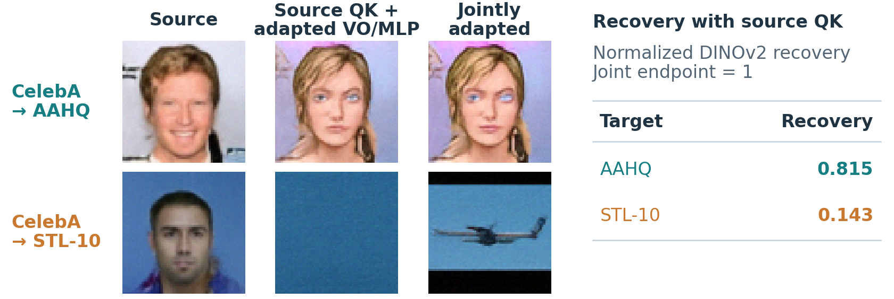

# Linking Representations, Denoising, and Transformer Modules for Controllable Multimodal Generation

**Principal investigator:** Xiang Cheng, Department of Electrical and Computer Engineering, Duke University  
**Focused Research Theme:** Internal Mechanisms of Multimodal Generative Models for Content Creation  
**Project duration:** 12 months  
**PI contact:** xiang.cheng@duke.edu; +1 484-630-3381

## Abstract

Multimodal diffusion models can generate rich visual content, yet we have limited understanding of how particular semantic requirements are carried through denoising and implemented by transformer computations. We propose to use **conditional dependencies among representation components to organize both generation and the computations that realize it**. We will obtain semantic representations from pretrained models and models trained on relevant downstream tasks, then hold these representations fixed while jointly learning denoising schedules and the transformer. By varying the information available in each component and intervening on attention and multilayer perceptron (MLP) contributions, we will identify which computations use that information, when they are needed, and when they can be shared. The PI's existing and ongoing work on continuous diffusion language models, learned asynchronous schedules, and mechanistic analysis of transformer components provides the foundation. The one-year project will deliver an integrated text-to-image model and sampler for generating scenes and varying a requested relationship while retaining other requirements, together with a mechanistic account of selected conditional computations.

## 1. The proposed contribution

**Which information does a diffusion model need for a particular prediction, when should that information become available, and which transformer computations use it?** Answering these questions together connects representation design to the internal mechanisms of generation. Existing methods demonstrate the value of semantic representations, asynchronous diffusion, and modular computations. Our proposed advance is to connect them through the same measurable conditional dependencies, providing a basis for precise generation and reusable computation.

Consider the request: “A woman in a red coat holds a blue cup beside a man in a green sweater.” A plausible-looking image can still put the cup in the wrong person's hand or exchange the clothing attributes. Information that helps predict who holds the cup should also help determine when relevant states are denoised and which attention or MLP computations carry that information into visual predictions. We will use this connection both to improve initial generation and to produce a variation that changes the cup's holder while retaining the other scene requirements.

Our central hypothesis is that **dependencies useful for conditional generation also identify opportunities to specialize and share transformer computations**. A component need not have a human-readable semantic label: its meaning can be characterized by which conditional predictions improve when it is available. Here, *locality* means dependence on a limited subset of representation components, which can span distant tokens or modalities. We seek selective information use where the task supports it, while identifying cases that require broader interactions.

We will obtain task-relevant activations and fix their components, jointly learn schedules and the transformer, then use measured dependencies to guide module access and sharing. Representation components remain fixed during dependency and schedule learning.

**A concrete starting point.** Initial schedule and module studies will use [SiT-B-scale][sit] diffusion transformers, approximately 130M parameters. The text-to-image prototype will build on pretrained [PixArt-Σ][pixart], connecting four fixed semantic components from DINOv2 and Qwen with the generator's image latents through an added semantic denoiser and conditional modules. Section 3 specifies the construction; Section 6 bounds the data and compute.

Continuous diffusion is important for both image and video generation. Text-to-image examples make the proposal concrete, while the same questions arise when video frames and semantic states progress at different noise levels, as motivated by [Diffusion Forcing][diffusionforcing]. The committed demonstration focuses on images; video is a subsequent extension.

## 2. Differentiation from the current state of the art

**Our proposed advance is to use measured conditional dependencies to connect representation availability, denoising progress, and reusable transformer computations.** We will use the same information-use measurements to guide which states are generated or retained, and where a shared prediction core needs a specialized conditional computation. This makes the connection actionable for controlled generation and gives it a mechanistic interpretation through component–module interventions.

| Closest approach | Existing contribution | Proposed advance |
|---|---|---|
| [SFD][sfd], [Latent Forcing][latentforcing], and our [LWD][schedule] | Generate complementary representations with separate schedules. LWD learns schedules; Latent Forcing measures noise-dependent predictive usefulness and tests output-specific branches. | Use measured dependencies to guide selective variation and predict where additional conditioning requires specialized computation. |
| [Local Mechanisms of Compositional Generalization][local] | Connect sparse conditional-score dependencies, including feature-space composition, to generalization and interventions. | Relate noise-dependent component usefulness to identifiable attention/MLP computations and their reuse across conditional tasks. |
| [Vision-Language Binding][binding] | Trace how reference information influences multimodal transformer predictions. | Combine causal analysis with learning schedules and conditional modules that exploit the identified information paths. |

The schedule is an operational use of dependence, rather than a unique graph recovered from data: varying noise levels measures predictive usefulness, while schedule optimization determines when producing that information is worthwhile. Latent Forcing's best tested schedule is fully cascaded; our contribution concerns how learned dependencies guide control and reusable computation, without assuming that a more interleaved schedule is always preferable. Compared with a general low-rank adaptation, the proposed module construction specifies which information a computation can access and which predictions it can change. For controlled variation, the distinction from attention-based editing such as [Prompt-to-Prompt][prompttoprompt] is to use measured conditional dependencies to guide representation availability, denoising progress, and module access.

## 3. Research approach: dependencies that organize denoising and transformer computation

The method first obtains fixed semantic components, then learns how their information supports denoising and transformer computation. SiT-B-scale studies develop the conditional tasks and interventions. The creator prototype retains the released 0.6B-parameter [PixArt-Σ][pixart] image transformer, text conditioning, and decoder, with approximately 20–50M trainable parameters in the added semantic branch, interfaces, and selected adaptations.


**Figure 1. Conditional information connects representation, generation, and computation.** Fixed representation components are characterized by their contribution to conditional predictions. Varying their noise levels reveals useful dependencies; learned schedules determine when information becomes available. Component and module interventions identify the transformer paths that use it. The illustrated component meanings, schedules, and module assignments are examples, not prescribed semantic labels or a fixed generation order.

### 3.1 Obtain task-relevant representations and fix their components

**Start with pretrained activations, then use activations learned for the desired task.** Frozen [DINOv2][dino] image-token activations and Qwen caption-token activations provide the first semantic representations. The second representation source will be a prompt-image compatibility model trained to distinguish correct descriptions from descriptions with reversed action roles or exchanged attributes. We will use its visual branch's hidden activations as generation targets: the training task encourages useful distinctions, while the resulting image representation does not require the correct caption as an input. [Discriminator features][vaegan] and [reward models][imagereward] motivate obtaining representations from such task signals. The committed comparison uses one such task-trained alternative to the pretrained visual features.

**A component is a specified group of representation coordinates.** For an image and its training description, let the encoder output token vectors with $d$ coordinates. Fit a principal-component projection on the training features, normalize their coordinate scales, and divide each projected token into two fixed coordinate groups. Collecting the first group across tokens gives one component vector; collecting the second gives another. Applying this construction separately to visual and language representations gives two visual components, $D_1,D_2$, and two language components, $Q_1,Q_2$. The complete VAE image-latent array, $V$, forms a fifth component. Write these vectors as $s_k\in\mathbb R^{d_k}$, where $k=1,\ldots,K$, $K=5$ initially, and $d_k$ is the number of coordinates in component $k$. Each component retains its token positions internally. Encoders, projections, normalization, and group assignments remain fixed during the following stages.

The groups need not correspond to human-named concepts. Their meaning will come from which conditional predictions improve when their information is available. For example, which visual groups help recover the missing word in “The [MASK] holds the cup”? Language-state denoising supplies a training task for learning these dependencies. A component can be a prediction target in one task and known conditioning in another. For complete-prompt image generation, encode the supplied text directly and keep its language states clean; generate the unknown visual states.

### 3.2 Jointly learn denoising order, conditional dependencies, and the transformer

**Vary how much information each component supplies.** Let $u_k\in[0,1]$ measure component $k$'s progress from noise toward data, and let $\varepsilon_k$ be independent standard Gaussian noise with $d_k$ coordinates. Form a noisy training state and its target rate of change as

```math
\widetilde s_k(u_k)=\alpha_k(u_k)s_k+\sigma_k(u_k)\varepsilon_k,
\qquad
r_k(u_k)=\alpha'_k(u_k)s_k+\sigma'_k(u_k)\varepsilon_k.
```

Primes denote derivatives with respect to $u_k$. For semantic components, use $\alpha_k(u_k)=u_k$ and $\sigma_k(u_k)=1-u_k$, so $r_k=s_k-\varepsilon_k$. For image latents, retain PixArt's signal and noise coefficients, traversed from high noise toward the image. The transformer receives all noisy components, their progress vector $\mathbf u=(u_1,\ldots,u_K)$, and conditioning $c$, which contains the supplied prompt or incomplete caption. Its output $f_{\theta,k}$ predicts $r_k$; $\theta$ denotes the trainable transformer parameters. Squared prediction error, averaged over a component's coordinates, gives its denoising loss. Generation integrates these predictions to produce complete states.

**Learn when to generate information.** Assign each component a monotone schedule $u_k=\tau_k(t;\phi)$, with generation time $t\in[0,1]$, schedule parameters $\phi$, and endpoints $\tau_k(0)=0$, $\tau_k(1)=1$. The schedules may overlap or cross. We begin with piecewise-linear schedules whose positive increments are learned. Write $\dot\tau_k$ for their rates, and abbreviate the prediction and target evaluated at these progress levels by $f_k$ and $r_k$. A concrete extension of our variational [schedule-learning][schedule] and [trajectory-optimization][trajectory] approach is

```math
\mathcal J(\theta,\phi)
=\mathbb E\!\left[\sum_{k=1}^{K}\frac{1}{d_k}
\left\{\dot\tau_k\|f_k-r_k\|_2^2
+\lambda\|\dot\tau_k f_k\|_2^2\right\}\right]
+\beta\mathcal L_{\mathrm{ind}}(\theta).
```

The expectation averages over training examples, Gaussian noise, and uniformly sampled $t$; $\|\cdot\|_2$ is the Euclidean norm. The first term trains predictions along the schedules, and the second discourages large generation velocities. The nonnegative coefficients $\lambda$ and $\beta$ set the penalties' relative weights. Here $\mathcal L_{\mathrm{ind}}$ is the same coordinate-averaged prediction loss at independently varied component progress levels, including clean conditions and fully masked targets. These configurations teach the model to use combinations of available information beyond those encountered on a single schedule. The displayed objective covers joint generation; in conditional tasks, hold supplied components at their specified progress levels, including clean known conditions, and restrict prediction losses and learned schedules to the target components.

Changing $\phi$ changes both the information available to the transformer and the prediction problems that train its weights. If cleaner component $X$ improves prediction of component $Y$, advancing $X$ can help generate $Y$, but may make $X$ itself harder to predict from its noisier surroundings. The joint objective balances these conditional prediction requirements without imposing a semantic-first order. After selecting schedules, we fit the final denoiser using prediction losses alone and remeasure dependencies, so the velocity penalty does not determine the final predictor's answer.

**Measure which information helps each conditional task.** Freeze a trained checkpoint and compare target denoising error when one conditioning component is clearer or noisier, keeping the target noise, other inputs, and examples fixed. A reduction in error measures a useful dependency for this model and context; it does not identify a unique underlying graph. To characterize several conditioning components together, optimize

```math
\min_{\mathbf u_C\in[0,1]^{|C|}}
\mathcal L_{\mathcal T}(\mathbf u_C)
+\rho\sum_{j\in C}u_j.
```

Here $\mathcal T$ is a conditional task, $C$ is its set of candidate conditioning components, $\mathbf u_C$ specifies their progress levels, $\mathcal L_{\mathcal T}$ is the expected target prediction loss, and $\rho>0$ penalizes exposing cleaner information. Target components remain at fixed noise levels. Fit one allocation across task examples and evaluate it on held-out examples. The result identifies an economical allocation of useful information; redundant components may substitute for one another, and the penalty limits total availability rather than guaranteeing a particular number of active components.

For the masked-caption diagnostic, remove the word from the conditioning caption before contextual encoding and keep all full-caption target states at pure noise. Disable the image-latent/backbone route so visual evidence enters only through the candidate visual groups. The task loss focuses on the missing caption position; a readout trained on clean training-caption states and then frozen reports missing-word accuracy from the predicted states. The same incomplete caption accompanies matched images with different cup holders. Full-prompt generation instead uses known language states to condition visual denoising. Independently varied visual noise levels also provide the starting point for controlled variation in Section 5: retain some source information while allowing other information to be regenerated under a revised instruction.

**Integrate the components with the pretrained image model.** Retain PixArt's native image noising, T5 conditioning, and VAE decoding. Convert its noise prediction into a rate of change along that same image path: if $y=\alpha s+\sigma\varepsilon$ is the noisy image latent and $\widehat\varepsilon$ its predicted noise, then $\widehat s=(y-\sigma\widehat\varepsilon)/\alpha$ and the image-rate prediction is $\alpha'\widehat s+\sigma'\widehat\varepsilon$. This algebraic conversion uses the checkpoint's finite noise endpoints. Added conditional modules modify image predictions using semantic states and predict the unknown states. Sampling advances target components using $\dot\tau_k f_k$, holds supplied language states clean, and decodes the final image latents through the existing VAE. The pretrained image model retains its native corruption process.

We will compare downstream generation conditioned on corrupted ground-truth visual semantic states with generation conditioned on model-generated visual states at corresponding noise levels. Prompt satisfaction and image quality will reveal whether accumulated semantic errors reduce the measured benefit. If necessary, short-rollout training will expose the conditional modules to generated states, following the motivation of [Self Forcing][selfforcing], using supervision appropriate to the conditional task.

### 3.3 Build and explain reusable conditional computations

**Use measured dependencies to define module access.** A module initially means one attention head or one MLP residual branch. Keep the target's own noisy state available, rank other components by their measured denoising benefit, and retain the smallest ranked input set whose masked-input validation error is within 5% of the full-input predictor. Omitted components are replaced by independent noise at progress zero during this selection; retain all inputs if needed. Train restricted attention heads to read only the selected component vectors before unrestricted mixing, with output projections writing only to designated targets.

**Predict where a shared computation needs a conditional correction.** Begin with two tasks that denoise the same image-latent target $V$. Task A receives the noisy image $\widetilde V$, prompt $c$, and noisy visual component $\widetilde D_1$; Task B also receives $\widetilde D_2$. Fix their noise levels for each comparison. Write the available inputs as $A=(\widetilde V,c,\widetilde D_1)$ and $B=(A,\widetilde D_2)$. For the image-rate target $r_V$, the optimal squared-loss predictors are $f_A=\mathbb E[r_V\mid A]$ and $f_B=\mathbb E[r_V\mid B]$. Their coordinate-averaged errors, $R_X=\mathbb E\|r_V-f_X\|_2^2/d_V$ for $X\in\{A,B\}$, satisfy

```math
R_A-R_B=\frac{1}{d_V}\mathbb E\|f_B-f_A\|_2^2.
```

Thus, a small benefit from the extra information predicts a small average change in the optimal denoising function at those noise levels. This provides a functional reason to reuse computation, although it does not by itself establish which weights can be shared. We will train a shared image-prediction core, including MLPs, that receives $A$ in both tasks. An added attention/residual branch reads $\widetilde D_2$ and is disabled for Task A. Concentrate specialization in noise regimes where $D_2$ provides a substantial measured benefit. Compare the same amount of specialization elsewhere, holding input access and parameter capacity fixed. Fix the permitted noise regimes in each comparison so learned gates cannot move specialization between them. Separate predictors provide a quality and parameter-cost reference. Training these tasks across varied participant–attribute combinations makes the reuse question concrete: can the same core support new compositions, with the conditional branch supplying the additional information?

Each added branch has a scalar gate, learned under the denoising loss, that uses component progress levels to control its contribution. This localizes computation in both components and denoising stages. Restrictions apply to added branches; the pretrained backbone remains a parallel information path. Retain dense access where needed.

**Connect a component's effect to a particular computation.** In matched images with different holders, measure the benefit of a candidate visual component, exchange it between images, then disable a candidate head or MLP and repeat. A specific mechanism is supported when removal suppresses the component's effect, restoration recovers it, and unrelated predictions remain usable. Match participant attributes and setting; include within-role swaps of comparable incidental content. Equally sized random-module interventions and perturbation-magnitude controls distinguish selective effects from general damage, following [activation-patching methodology][patching]. Predict and test at least one component–module effect in an unrestricted checkpoint before imposing access restrictions, then examine reuse on unseen compositions.

These case studies identify information paths in the conditional denoiser and added branches. Carry selected interventions through complete image generation, holding T5 conditioning constant, to connect the mechanistic account to useful control.

## 4. Existing results and feasibility

**Learned generation schedules.** On class-conditional ImageNet-256, our [LWD][schedule] achieves FID **4.93 versus REPA's 5.84** with **120,000 versus 4 million main-training updates**, plus a 10,000-update schedule-learning phase. This is approximately 33 times fewer main-training updates for the overall method. Its strongest reported FID is **1.02 with a 675M-parameter model**, below the **1.04** reported for the 1B-parameter SFD-XXL in that comparison. These results demonstrate the potential of asynchronous multi-representation generation. At a matched 400,000-update budget, learning the schedule also improves unguided FID from **3.53 to 2.87** with the same SemVAE representation, directly supporting schedule adaptation within a fixed representation.

**Interpretable and reusable transformer computations.** Our [attention-as-denoising analysis][softmax] and ongoing *Adaptive Patchwise Denoisers* study connect attention-based aggregation with prediction knowledge that can be stored in MLPs. Preliminary sharing experiments improve CelebA64 FID from **17.574 to 14.304** at approximately **10.2M parameters**. Selective restoration of source weights after adaptation produces different outcomes across dataset shifts (Figure 2), motivating an account of which computations remain compatible and reusable. These experiments provide implementations and evidence for the ingredients; the proposed semantic component–module correspondence is the next step.



**Figure 2. Existing evidence motivates selective reuse.** Source query/key weights are restored after adaptation, retaining adapted value/output projections and MLPs. Recovery is $1-E_{\mathrm{hybrid}}/E_{\mathrm{source}}$, where $E$ is mean squared distance to paired jointly adapted outputs in unit-normalized DINOv2 features. Scores average two adaptation seeds with 1,024 paired latents per seed; the displayed images are illustrative matched examples. The AAHQ result motivates selective reuse, while the STL-10 result motivates understanding when coordinated changes are needed.

**Continuous diffusion of language states.** In preliminary experiments based on [Embedded Language Flows][elf], our approximately **800M-parameter continuous diffusion denoiser**, with a **121M-parameter encoder**, uses Qwen-3-derived latent states and achieves **62.47% GSM8K accuracy**, compared with **66.6%** reported for the 7B [TESS 2][tess] model after mathematics-specific fine-tuning, under different training settings. This provides an encouraging foundation for generating reasoning-relevant contextual states via continuous latent diffusion alongside visual components.

## 5. Demonstration, evaluation, and relevance to Sony

**Final model: generate a scene, then vary one relationship while retaining the other requirements.** The integrated model and sampler will support a creator's iterative development of scene concepts for games, animation, and film. Starting from “A woman in a red coat holds a blue cup beside a man in a green sweater,” the creator requests: “Put the cup in the man's hand. Keep their clothing, positions, and the surrounding scene.” The target capability is coordinated control of who holds the object, including necessary hand and arm changes, with limited unintended changes elsewhere. The accompanying mechanistic account addresses [Sony's interests][sony] in modality binding, generation dynamics, and causal interventions.

**A first implementation using the conditional denoiser.** Save a generated image's latents and encode its visual representations. Apply the component-specific corruption in Section 3.2, then denoise under the revised prompt with clean language states. Building on [SDEdit][sdedit], we use measured dependencies to select how much source information each component retains.

Visual groups that inform the holder prediction are candidates for greater noise, weakening the original assignment. Other groups and image latents initially retain more source information. All visual states remain free to update because groups may carry several properties requiring coordinated changes. Rescale each learned schedule from its selected starting progress to the clean endpoint, using the same conditional modules and gates. Training with independently varied noise levels supports these starting configurations; preservation under a changed instruction remains an outcome to establish.

Select component allocations and restart strengths on validation cases, then fix them for held-out use. Both visual groups can receive more noise if necessary. Retaining more source information favors preservation; adding noise permits larger changes. Forward corruption supplies the starting states without image inversion, a separately trained editor, or an assumption that cached trajectories support conditional restarts.

**Creator-facing evidence.** Use 50 source scenes from a prespecified subset of the held-out prompts for controlled variations, within the existing evaluation allowance. Give the same sources and revised instructions to ordinary regeneration, a uniform-noise restart, and component-dependent restarts. Compare allocations selected using measured dependencies with directly tuned allocations over the same noise ranges, candidate counts, validation examples, and sampling budgets. Direct tuning can itself exploit conditional dependencies; this comparison measures the added value of using them explicitly to select allocations. Report variation success conditional on a correct source, and end-to-end success across all prespecified attempts. Assess the requested holder change together with retained clothing, approximate participant placement, and recognizable surrounding scene; necessary object, hand, and arm movement is allowed. Blinded judges assess visual plausibility and major artifacts. Report joint change-and-preservation success and runtime under a fixed attempt limit. A final side-by-side demonstration will show the source, requested change, baseline variation, and our output, including representative failures.

The masked-caption task identifies information useful for a conditional prediction. Generation and controlled variation demonstrate its practical value with known instructions. Module interventions connect the internal account to the final image.

### Hypotheses, comparisons, and existing support

| Hypothesis | Focused comparison and outcome | Existing support |
|---|---|---|
| Task-trained activations carry useful information for generation. | Compare pretrained and task-trained representations on common conditional tasks; freeze each before denoising training. Measure semantic correctness on held-out examples. | Language-state diffusion supports feasibility; the task-trained visual extension is proposed. |
| Schedules should reflect conditional prediction requirements. | Fixed versus learned schedules, with the same representation and architecture and a trained denoiser in both. Measure joint prompt satisfaction and image quality. | LWD demonstrates benefits for two fixed representation groups. |
| Dependencies identify useful, reusable computations. | Share an image-prediction core across tasks with one versus two visual inputs; place equal specialization in predicted versus alternative noise regimes. Measure quality, reuse, and component–module effects. | Attention/MLP analysis and weight-sharing/replacement results provide partial support. |
| The integrated generator benefits from both choices. | Cross fixed/learned schedules with ordinary/dependency-guided modules within one fixed representation. Assess all prompt requirements together using generated states. | The full connection is the proposed contribution. |

**A bounded evaluation.** The main endpoint is the fraction of images satisfying all specified participant, attribute, and role requirements. Plan **200 held-out prompts with four noise realizations each per trained model**. The four main variants use two training seeds, with matched data, semantic supervision, trainable capacity, guidance, and sampling budget. “Ordinary” modules use unrestricted component access with the same conditional supervision. SiT-B-scale controls permute the selected inputs while matching the number of connections and sharing architecture, isolating the value of measured dependencies. An inference-only comparison with unmodified PixArt shows the overall benefit relative to the starting generator. Report paired differences with prompt-level bootstrap confidence intervals and variation across training seeds, alongside individual requirement scores and image quality. Count feature preparation and schedule/module selection in training cost. Representation-source comparisons run primarily in the SiT-B-scale studies.

[GenEval][geneval] supplies a starting point for object and attribute assessment. Role correctness requires an independent role-aware evaluator, checked against two raters blinded to the method on a common 200-image subset per variant; human judgments take precedence where the automated score is unreliable. The same subset supports paired visual-quality judgments against the ordinary-module baseline, using a plausibility/artifact rubric and degradation tolerance fixed on validation cases. Visually undecidable roles count as unsuccessful in the primary endpoint. The separate **100–300 matched mechanistic cases** use component swaps, module removal/restoration, equally sized control interventions, and checks for collateral changes. Useful progress combines improved joint satisfaction and acceptable visual quality with a reproducible component–module effect. If a task needs broad access or separate predictors, identifying that boundary still informs reliable architecture choices.

Reference-based identity across scenes, multiple simultaneous activities, and video extend the same motivation. In video, an interaction's roles must remain consistent while object positions evolve; asynchronous diffusion already provides a relevant foundation. These extensions follow the bounded image demonstration when data and compute permit.

## 6. Execution, resources, and deliverables

### Models, data, and compute

The initial conditional schedule and module studies use **SiT-B-scale diffusion transformers, approximately 130M parameters**, at 256-pixel image resolution in latent space. These bounded comparative studies develop the shared-core hypothesis and conditional tasks. The text-to-image prototype uses the approximately **0.6B-parameter PixArt-Σ backbone**, beginning at 256 pixels and scaling to 512 pixels after the month-6 decision. Its VAE, native text encoder, and most backbone weights remain fixed. A semantic branch, interfaces, and selected conditional computations target **20–50M trainable parameters**. A separate **10–20M-parameter task model** on cached visual/language features supplies one task-trained representation alternative. Frozen backbone computation is included in the compute estimates.

We will select approximately **20,000 training images**, with a **50,000-image ceiling**, from [SWiG][swig] role annotations and [Visual Genome][visualgenome] objects, attributes, and relations. Holding an object is the initial relation: require visible hand–object contact or support that distinguishes the holder. Month-3 selection will check annotation coverage and role observability; ambiguous examples are excluded from the mechanistic cases. The broad corpus supports conditional training; 100–300 manually checked matched cases support the focused study. Existing generators can supply controlled role changes where natural pairs are unavailable, with generated examples checked for the intended requirements. Image-level splits keep captions, crops, and related synthetic variants together; selected attribute/role combinations are withheld while their individual elements remain represented in training.

The project will use **Duke's two available H200 clusters**. We estimate approximately **5,600 H200 GPU-hours** across the studies below; one GPU-hour denotes one GPU used for one hour. Run allocations are planning allowances, with scheduling subject to cluster availability.

| Work | Planned allocation | GPU-hours |
|---|---|---:|
| SiT-B-scale schedule/module studies | 8 runs × 2 GPUs × 72 hours | 1,152 |
| Main generation comparisons | 8 runs × 4 GPUs × 72 hours | 2,304 |
| Feature preparation and task-model training | Combined allowance | 600 |
| Generation evaluation and mechanistic studies | Combined allowance | 900 |
| Integration and repeat-run reserve | Reserve | 644 |
| **Total** | | **5,600** |

Month-3 implementation profiling will determine batch size, feasible update counts, and resolution within these allowances. Main runs target 5,000–20,000 updates at effective batch 64 where measured runtime permits, including validation and checkpointing. Core comparisons and evaluation take priority over additional configurations or higher resolution.

### Milestones and minimum deliverable

| Period | Main work | Concrete output or decision |
|---|---|---|
| Months 1–3 | Curate the interaction subset; obtain fixed representations and one task-trained alternative; build conditional denoisers and the image interface. | Working baseline, component definitions, and measured runtime. Select the interaction family and confirm the planned runs. |
| Months 4–6 | Jointly learn schedules and the transformer; characterize dependencies; conduct initial component–module interventions. | A usable conditional generator and reproducible information-path effect. Scale to 512 pixels if data, integration, and runtime support it. |
| Months 7–9 | Train dependency-guided attention and shared prediction modules; select partial-noise restart settings on validation cases. | Integrated generation model and sampler; initial controlled variations and computation-reuse results. |
| Months 10–12 | Complete held-out generation, controlled-variation, and intervention/restoration studies. | Creator demonstration, model and sampler, mechanistic case study, evaluation materials, and final report. |

The minimum deliverable combines **two participants, one object-holder relation, one pretrained representation configuration and one task-trained alternative, one sharing hypothesis, and one rigorous component–module case study**, with controlled variation of the model's own scenes. Each representation is fixed before denoising training. If integration is slower than anticipated, retain the smaller resolution. Where sparse access or sharing is ineffective, use broader access or separate predictors. The delivered sampler will expose the measured tradeoff between requested changes and preservation rather than promise exact pixel retention.

The PI will direct the mechanistic analysis and research design, with one graduate research assistant supported for 12 months. The project will provide three quarterly reports, a final research summary, and progress-questionnaire responses.

## References

1. Oquab et al. [DINOv2: Learning Robust Visual Features without Supervision][dino]. arXiv:2304.07193, 2023.
2. Pan et al. [Semantics Lead the Way: Harmonizing Semantic and Texture Modeling with Asynchronous Latent Diffusion][sfd]. arXiv:2512.04926, 2025.
3. Bradley. [Local Mechanisms of Compositional Generalization in Conditional Diffusion][local]. arXiv:2509.16447, revised 2026.
4. Ge et al. [Vision-Language Binding in In-Context Image Generation][binding]. arXiv:2605.24624, 2026.
5. Rosu, Carin, and Cheng. [From Softmax to Score: Transformers Can Effectively Implement In-Context Denoising Steps][softmax]. NeurIPS, 2025.
6. Liu, Li, and Cheng. [Variational Trajectory Optimization of Anisotropic Diffusion Schedules][trajectory]. arXiv:2602.19512, 2026.
7. Qian and Cheng. [Learning When to Denoise: Optimizing Asynchronous Schedules for Latent Diffusion][schedule]. arXiv:2606.19662, 2026.
8. Larsen et al. [Autoencoding beyond pixels using a learned similarity metric][vaegan]. arXiv:1512.09300, 2015.
9. Xu et al. [ImageReward: Learning and Evaluating Human Preferences for Text-to-Image Generation][imagereward]. arXiv:2304.05977, 2023.
10. Chen et al. [Diffusion Forcing: Next-token Prediction Meets Full-Sequence Diffusion][diffusionforcing]. arXiv:2407.01392, 2024.
11. Baade et al. [Latent Forcing: Reordering the Diffusion Trajectory for Pixel-Space Image Generation][latentforcing]. arXiv:2602.11401, 2026.
12. Ghosh, Hajishirzi, and Schmidt. [GenEval: An Object-Focused Framework for Evaluating Text-to-Image Alignment][geneval]. arXiv:2310.11513, 2023.
13. Chen et al. [PixArt-Σ: Weak-to-Strong Training of Diffusion Transformer for 4K Text-to-Image Generation][pixart]. Implementation and released checkpoints.
14. Pratt et al. [Grounded Situation Recognition (SWiG)][swig]. ECCV, 2020; project and annotations.
15. Krishna et al. [Visual Genome: Connecting Language and Vision Using Crowdsourced Dense Image Annotations][visualgenome]. IJCV, 2017.
16. Hu et al. [ELF: Embedded Language Flows][elf]. arXiv:2605.10938, 2026.
17. Tae et al. [TESS 2: A Large-Scale Generalist Diffusion Language Model][tess]. arXiv:2502.13917, 2025.
18. Huang et al. [Self Forcing: Bridging the Train-Test Gap in Autoregressive Video Diffusion][selfforcing]. NeurIPS, 2025.
19. Heimersheim and Nanda. [How to Use and Interpret Activation Patching][patching]. arXiv:2404.15255, 2024.
20. Hertz et al. [Prompt-to-Prompt Image Editing with Cross Attention Control][prompttoprompt]. arXiv:2208.01626, 2022.
21. Meng et al. [SDEdit: Guided Image Synthesis and Editing with Stochastic Differential Equations][sdedit]. ICLR, 2022.
22. Ma et al. [SiT: Exploring Flow and Diffusion-based Generative Models with Scalable Interpolant Transformers][sit]. arXiv:2401.08740, 2024.

**Unpublished preliminary materials.** The PI's working manuscript, *A Mechanistic View of Diffusion Transformers as Adaptive Patchwise Denoisers*, and associated sharing/transfer experiment reports; continuous diffusion language-model results supplied by the PI. These support the preliminary findings in Section 4.

## Budget summary

**Total requested: USD 144,300 for 12 months.** The budget supports 1.5 months of PI salary and 12 months of support for one graduate research assistant, together with associated fringe benefits and graduate tuition remission. Personnel will carry out the proposed representation learning, mechanistic analysis, model development, and creator demonstrations.

| Budget category | Amount (USD) |
|---|---:|
| PI salary: Xiang Cheng, 1.5 months | 23,833 |
| Graduate research assistant stipend: 12 months | 44,213 |
| PI fringe benefits: 28.83% of PI salary | 6,871 |
| Graduate research assistant fringe benefits: 11.45% of stipend | 5,062 |
| Graduate tuition remission: 34.23% of stipend | 15,134 |
| **Total direct costs** | **95,113** |
| Indirect costs: 61.5% of modified total direct costs | 49,187 |
| **Total requested** | **144,300** |

**Budget basis.** Amounts follow the supplied institutional budget, rounded to whole dollars. PI salary uses a nine-month salary basis of USD 143,000. The modified total direct cost base is USD 79,979, consisting of salaries/stipend and fringe benefits; tuition remission is excluded. Applying the 61.5% indirect cost rate gives USD 49,187. No funding is requested for equipment, supplies, travel, other expenses, or subcontracts. The total includes indirect costs and is within the Focused Research Award limit of USD 150,000.


[dino]: https://arxiv.org/abs/2304.07193
[sfd]: https://arxiv.org/abs/2512.04926
[local]: https://arxiv.org/abs/2509.16447
[binding]: https://arxiv.org/abs/2605.24624
[softmax]: https://papers.nips.cc/paper_files/paper/2025/hash/d27af2bebeab8a3e6f3848fc71736235-Abstract-Conference.html
[trajectory]: https://arxiv.org/abs/2602.19512
[schedule]: https://arxiv.org/abs/2606.19662
[sony]: https://www.sony.com/en/SonyInfo/research-award-program/
[vaegan]: https://arxiv.org/abs/1512.09300
[imagereward]: https://arxiv.org/abs/2304.05977
[diffusionforcing]: https://arxiv.org/abs/2407.01392
[latentforcing]: https://arxiv.org/abs/2602.11401
[geneval]: https://arxiv.org/abs/2310.11513
[pixart]: https://github.com/PixArt-alpha/PixArt-sigma
[swig]: https://prior.allenai.org/projects/gsr
[visualgenome]: https://arxiv.org/abs/1602.07332
[elf]: https://arxiv.org/abs/2605.10938
[tess]: https://arxiv.org/html/2502.13917v1#S4.T3
[selfforcing]: https://arxiv.org/abs/2506.08009
[patching]: https://arxiv.org/abs/2404.15255
[prompttoprompt]: https://arxiv.org/abs/2208.01626
[sdedit]: https://arxiv.org/abs/2108.01073

[sit]: https://arxiv.org/abs/2401.08740
